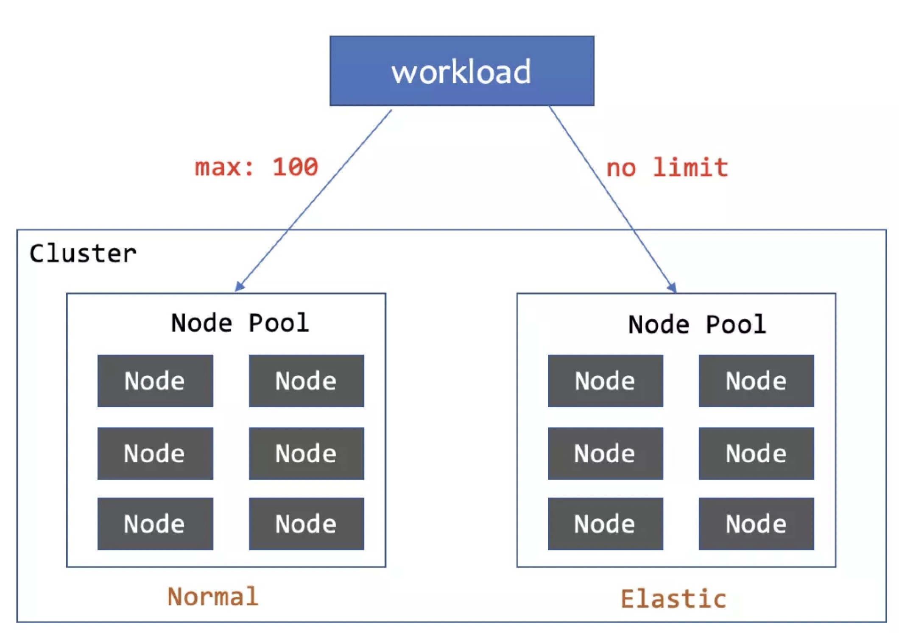
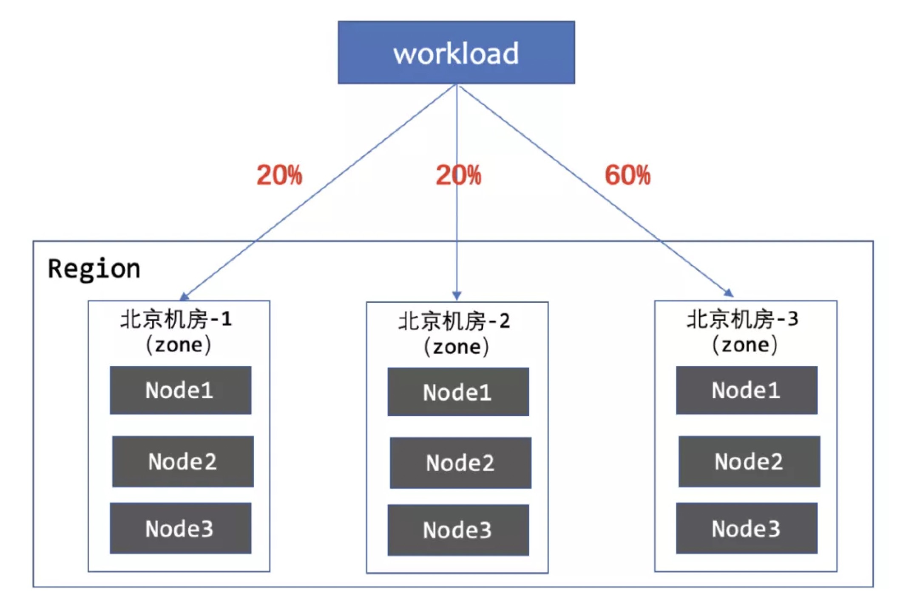
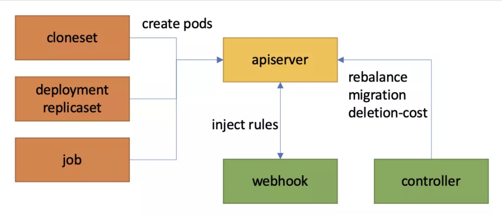

## Background

Deploying an application in different zones, different hardware types, and even different clusters and cloud vendors is becoming a very common requirement with the development of cloud native techniques. 
For examples, these are some cases:
1. Cases about disaster tolerant:
  - Application pods is scattered according to the nodes to avoid stacking.
  - Application pods is scattered according to available zones.
  - Different nodes/zones/domains require different scale of pods.
2. Cases about cost control:
  - People deploy an applications preferentially to their own resource pool, and then deployed to elastic resource pool, such as ECI on Aliyun and Fragate on AWS, when own resources are insufficient. When shrinking, the elastic node is preferred to shrink to save cost.

In most cases, people always split their application into multiple workloads (such as several `Deployment`) to deploy. However，this solution often requires manual management by SRE team, or a deeply customized PAAS to support the careful management of multiple workloads for this one application.

In order to solve this problem, WorkloadSpread feature has been proposed in version v0.10.0 OpenKruise. It can support multi-kind of workloads, such as `Deployment`, `Replicaset`, `Job`, and `Cloneset`, to manage the partition deployment or elastic scaling. The application scenario and implementation principle of WorkloadSpread will be introduced in detail below to help users better understand this feature.

---

## Introduction

More details about WorkloadSpread can be found in [Official Document](https://openkruise.io/docs/user-manuals/workloadspread). 

In short, WorkloadSpread can distribute pods of a workload to different types of nodes according to certain rules, so as to meet the above fragmentation and elasticity scenarios. WorkloadSpread is non-invasive, "plug and play", and can be effective for stock workloads.

---

## Comparison with related works

Let's make a simple comparison with some related works in the community.

### 「1」Pod Topology Spread Constrains
[Pod topology spread constraints](https://kubernetes.io/docs/concepts/workloads/pods/pod-topology-spread-constraints/) is a solution provided by Kubernetes community. It can horizontally scatter pods according to topology key. The scheduler will select the node that matches the conditions according to the configuration if users defined this rule.

Since Pod Topology Spread is evenly dispersed, it **cannot** support exact customized partition number and proportion configuration. Furthermore, the distribution of pods will be destroyed when scaling down. 
Using WorkloadSpread can avoid these problems.

### 「2」UnitedDeploymen
[UnitedDeployment](https://openkruise.io/docs/user-manuals/uniteddeployment) is a solution provided by the OpenKruise community. It can manage pods in multiple regions by creating and managing multiple workloads.

UnitedDeployment supports the requirements of fragmentation and flexibility very well. But, it is a new workload, and the use cost and migration costs will be relatively high, whereas WorkloadSpread is a lightweight solution, which only needs to apply a simple configuration to associate the workload.

---

## Use Case

In the section, I will list some application scenarios of WorkloadSpread and give corresponding configurations to help users quickly understand the WorkloadSpread feature.

### 「1」Deploy 100 pods to normal node pool, rest pods to elastic node pool



```yaml
subsets:
- name: subset-normal
  maxReplicas: 100
  requiredNodeSelectorTerm:
    matchExpressions:
    - key: app.deploy/zone
      operator: In
      values:
      - normal
- name: subset-elastic 
# maxReplicas==nil means no limit for replicas
  requiredNodeSelectorTerm:
    matchExpressions:
    - key: app.deploy/zone
      operator: In
      values:
      - elastic
```

When the workload has less than 100 replicas, all pods will be deployed to the normal node pool, and more than 100 are deployed to the elastic node pool. When scaling down, the pods on the elastic node will be deleted first.

Since workload spread limits the distribution of workload, but does not invade workload. Users can also dynamically adjust the number of replicas according to the resource load in combination with HPA. 

In this way, it will be automatically scheduled to the elastic node pool when receiving peak flow, and give priority to releasing the resources in the elastic resource pool when the peak gone.


### 「1」Deploy pods to normal node pool first, to elastic resource pool when normal node pool is insufficient


```yaml
scheduleStrategy:
  type: Adaptive
  adaptive:
    rescheduleCriticalSeconds: 30
    disableSimulationSchedule: false
subsets:
- name: subset-normal
  requiredNodeSelectorTerm:
    matchExpressions:
    - key: app.deploy/zone
      operator: In
      values:
      - normal
- name: subset-elastic
  requiredNodeSelectorTerm:
    matchExpressions:
    - key: app.deploy/zone
      operator: In
      values:
      - elastic
```

Both subsets have no limit on the number of replicas, and the `Adaptive` rescheduling policy are enabled. 
The goal is to preferentially deploy to the normal node pool. When normal resources are insufficient, webhook will select elastic nodes through simulated scheduling. When the pod in the normal node pool is in the pending state and exceeds the 30s threshold, the WorkloadSpread controller will delete the pod to trigger pod reconstruction, and the new pod will be scheduled to the elastic node pool. During volume reduction, the pod on the elastic node is also preferentially reduced to save costs for users.

### 「3」Scatter to 3 zones, the scale is 1:1:3



```yaml
subsets:
- name: subset-a
  maxReplicas: 20%
  requiredNodeSelectorTerm:
    matchExpressions:
    - key: topology.kubernetes.io/zone
      operator: In
      values:
      - zone-a
- name: subset-b
  maxReplicas: 20%
  requiredNodeSelectorTerm:
    matchExpressions:
    - key: topology.kubernetes.io/zone
      operator: In
      values:
      - zone-b
- name: subset-c
  maxReplicas: 60%
  requiredNodeSelectorTerm:
    matchExpressions:
    - key: topology.kubernetes.io/zone
      operator: In
      values:
      - zone-c   
```

WorkloadSpread ensures that the pods are scheduled according to the defined proportion when scaling up and down.

### 「4」Configures different resource quotas on different CPU architecture


```yaml
subsets:
- name: subset-x86-arch
  # maxReplicas...
  # requiredNodeSelectorTerm...
  patch:
    metadata:
      labels:
        resource.cpu/arch: x86
    spec: 
      containers:
      - name: main
        resources:
          limits:
            cpu: "500m"
            memory: "800Mi"
- name: subset-arm-arch
  # maxReplicas...
  # requiredNodeSelectorTerm...
  patch:
    metadata:
      labels:
        resource.cpu/arch: arm
    spec: 
      containers:
      - name: main
        resources:
          limits:
            cpu: "300m"
            memory: "600Mi"
```

From the above example, we have patched different labels and container `resources` for the pods of two subsets, which is convenient for us to manage the pod more finely. When workload pods are distributed on nodes of different CPU architectures, configure different resource quotas to make better use of hardware resources.

---

## Implementation

WorkloadSpread is a pure bypass elastic/topology control solution. Users only need to create a corresponding WorkloadSpread config for their Deployment/Cloneset/Job/ReplicaSet Workloads. There is no need to change the them, and users will be no additional cost to use the WorkloadSpread.



### 「1」 How to decide the priority when scaling up?
Multiple subsets are defined in WorkloadSpread, and each subset represents a logical domain. Users can freely define subsets according to node configuration, hardware type, zone, etc. In particular, we defined the priority of subsets:

- The priority is defined from high to low in the order from front to back, for example `subset[i]` has higher priority than `subset[j]` if `i < j`.

- The pods will be scheduled to the subsets with higher priority first.
  
### 「2」 How to decide the priority when scaling down?
Theoretically, the bypass solution of WorkloadSpread cannot interfere with the scaling logic in the workload controller.

However, this problem has been solved in the near future. Through the unremitting efforts (feedback) of users, k8s since version 1.21, it has been supported for ReplicaSet (deployment) to specify the "deletion cost" of the pods by setting the annotation `controller.kubernetes.io/pod-deletion-cost`: the higher the deletion cost, the lower the priority of deletion.

Since version v0.9.0 OpenKruise, the deletion cost feature has been supported in cloneset.

**Therefore, the WorkloadSpread controller controls the scaling down order of the pods by adjusting their deletion cost.**

For example, an WorkloadSpread associated a CloneSet with 10 replicas is as follows:

```yaml
  subsets:
  - name: subset-a
    maxReplicas: 8
  - name: subset-b
```

Then the deletion cost value and deletion order are as follows:
- 8 pods in subset-a will have 200 deletion cost;
- 2 pods in subset-b will have 100 deletion cost, and will be deleted first;
  
If user modify WorkloadSpread as:

```yaml
  subsets:
  - name: subset-a
    maxReplicas: 5 # 8->5, 
  - name: subset-b
```

Then the deletion cost value and deletion order will also changed as follows:
- 5 pods in subset-a will have 200 deletion cost;
- 3 pods in subset-a will have -100 deletion cost, and will be deleted first;
- 2 pods in subset-b will have 100 deletion cost;

In this way, workload can preferentially scale down those pods that exceed the subset `maxReplicas` limit.

### 「3」 How to solve the counting problems?
How to ensure that webhook injects pod rules in strict accordance with the priority order of subset and the number of maxReplicas is a key problem at the implementation of WorkloadSpread.

#### 3.1 solving concurrency consistency problem
Sine there may be several kruise-controller-manager pods and lots of webhook Goroutines to process the same WorkloadSpread, the concurrency consistency problem must exist.

In the status of WorkloadSpread, there are the `subsetStatuses` field corresponding to each subset. The `missingReplicas` field in it indicates the number of pods required by the subset, and - 1 indicates that there is no quantity limit (`subset.maxReplicas == nil`).

```yaml
spec:
  subsets:
  - name: subset-a
    maxReplicas: 1
  - name: subset-b
  # ...
status:
  subsetStatuses:
  - name: subset-a
    missingReplicas: 1
  - name: subset-b
    missingReplicas: -1
  # ...
```

When webhook receives a pod create request:
1. Find a suitable subset with `missingReplicas` greater than `0` or equals to `-1`  according to the subset order.
2. After finding a suitable subset, if `missingReplicas` is greater than `0`, subtract `1` first and try to update the WorkloadSpread status.
3. If the update is successful, inject the rules defined by the subset into the pod.
4. If the update fails, get the WorkloadSpread again to get the latest status, and return to step 1 (there is a certain limit on the number of retries).

Similarly, when webhook receives a pod delete or eviction request, `MisingReplicas` will add `1` to missingreplicas and update it.

There is no doubt that we are using optimistic locks to solve update conflicts. **However, it is not appropriate to only use optimistic locks**, because workload will create a large number of pods in parallel, and APIServer will send many pod create requests to webhook in an instant, resulting in a lot of conflicts in parallel processing.
As we all know, optimistic lock is not suitable for too many conflicts, because the retry cost of solving conflicts is very high. To this end, we also added a WorkloadSpread level mutex to limit parallel processing to serial processing. There is a new problem in adding mutex locks, that is, after the current root obtains the lock, it is very likely that the WorkloadSpread obtained from infomer is not up-to-date, and will conflict as well. Therefore, after updating the WorkloadSpread, the Goroutine caches the latest WorkloadSpread and then releases the lock, so that the new Goroutine can directly get the latest WorkloadSpread from the cache after obtaining the lock. Of course, in the case of multiple webhooks, we still need to combine the optimistic lock mechanism to solve the conflict.

#### 3.2 solving data consistency problem

So, is the `missingReplicas` field controlled by the webhook? The answer is **NO**, because:

1. The pod create request received by webhook may not really succeed in the end (for example, pod is illegal or fails in subsequent quota verification).

2. The pod delete/eviction request received by webhook may not really succeed in the end (for example, it is intercepted by PDB, PUB, etc.).

3. There are always various possibilities in k8s, leading to the end or disappearance of the pods without going through webhook (for example, phase enters succeeded/failed, or ETCD data is lost, etc.).

4. At the same time, this is not in line with the end state oriented design concept.

Therefore, the WorkloadSpread status is controlled by webhook in collaboration with the controller:

- Webhook requests link interception in pod create/delete/ eviction, and modifies the `missingReplicas`.

- At the same time, the controller's reconcile will also get all pods under the current workload, classify them according to the subset, and update `missingReplicas` to the actual missing quantity.

- From the above analysis, it is likely that there is a delay for the controller to obtain the pod from the informer, so we also added the `creatingPods` map in the status. When the pod is injected at webhook, the key will be recorded as pod name and value are timestamp to the map, and the controller maintains the real `missingReplicas` in combination with the map. Similarly, there is also a `deleteingPods` map to record the delete/eviction event of the pod.

### 「4」What to do if pod schedule fails?
The configuration of reschedule strategy is supported in WorkloadSpread. By default, the type is fixed, that is, the pod is scheduled to the corresponding subset according to the sequence of each subset and the `maxReplicas` limit.

However, in real scenarios, many times, the resources of subset may not fully meet the number of maxReplicas due to some reasons, such as insufficient resources. Users need a more flexible reschedule strategy.

The adaptive capabilities provided by WorkloadSpread are logically divided into two types:

1. SimulationSchedule: scheduling records exists in informer, so we want to simulate the scheduling of pods in webhook. That is, simple filtering is performed through `nodeSelector`/`Affinity`, Tolerances, and basic resources resources. (not applicable to virtual-kubelet)

2. Reschedule: After scheduling the pod to a subset, if the scheduling failure exceeds the rescheduleCriticalSeconds time, mark the subset as unscheduled temporarily, and delete the pod to trigger reconstruction. By default, unscheduled will be reserved for 5min, that is, pod creation within 5min will skip this subset.

---

## Conclusion

WorkloadSpread combines some existing features of Kubernetes to give workload the ability of elastic and multi-domain deployment in the form of bypass. We hope that users can reduce workload deployment complexity by using WorkloadSpread and effectively reduce costs by taking advantage of its elastic scalability.

At present, WorkloadSpread is applied to some project in Alibaba, and adjustments in the use will be fed back to the community in time. In the future, there are some new capability plans for WorkloadSpread, such as managing the existing pods, supporting batch workloads, and even using label to match the pod across different workloads. Some of these capabilities need to actually consider the needs and scenarios of community users. I hope you can participate in kruise community, mention Issues and PRs, help users solve the problems of more cloud native deployment, and build a better community.

---
## Reference
- WorkloadSpread: https://openkruise.io/docs/user-manuals/workloadspread
- Pod Topology Spread Constrains: https://kubernetes.io/docs/concepts/workloads/pods/pod-topology-spread-constraints/
- UnitedDeployment: https://openkruise.io/docs/user-manuals/uniteddeployment