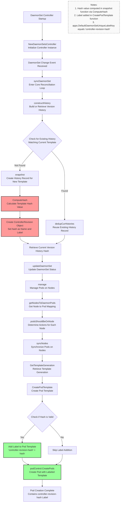

# Deep Dive into Kubernetes DaemonSet Version Control: The Complete Journey of controller-revision-hash

In the Kubernetes ecosystem, the controller pattern serves as the foundation for maintaining cluster state. The DaemonSet controller, as a critical component, ensures that a specified Pod replica runs on every eligible node in the cluster. When a DaemonSet's template is updated, the controller requires a mechanism to precisely identify and manage Pods of different versions. This capability is enabled by the `controller-revision-hash` label.

This article takes a deep dive into the Kubernetes DaemonSet controller’s version control mechanism, thoroughly analyzing the complete process from template hash calculation to injecting the `controller-revision-hash` label into newly created Pods.

## TL;DR

1. **DaemonSet uses `controller-revision-hash` labels** to track Pod template versions and enable precise rolling updates
2. **Hash computation happens in `snapshot()` function** when a new template version is detected via `constructHistory()`
3. **ControllerRevision objects store version history** - each template change creates a new ControllerRevision with computed hash
4. **Hash collision prevention**: Old ControllerRevision objects use their object name (guaranteed unique) instead of recomputed hashes
5. **Label injection occurs in `CreatePodTemplate()` function** before Pod creation, adding the hash as `controller-revision-hash` label
6. **Version identification enables selective updates** - controller compares existing Pod labels with current hash to determine which Pods need replacement
7. **The complete flow**: Template change → Hash computation → ControllerRevision creation → Label injection → Pod creation with version identifier

## Historical Context

In Kubernetes 1.7, a version control label was introduced to better support DaemonSet rolling updates and related features. Initially named `daemonset-controller-hash`, it was later renamed to `controller-revision-hash` to maintain consistency with StatefulSet's implementation. This change reflects Kubernetes API design's evolution toward standardization and consistency.

* [GitHub Issue: Consistent hash label key across controllers](https://github.com/kubernetes/kubernetes/issues/47554)
* [GitHub PR: Rename DaemonSet and StatefulSet hash label](https://github.com/kubernetes/kubernetes/pull/47557)

## Overview: Why controller-revision-hash is Essential

The `controller-revision-hash` label is the cornerstone of DaemonSet's declarative update mechanism, particularly for rolling updates. Its primary purpose is to **create a unique, traceable fingerprint for each version of a DaemonSet's Pod template (`.spec.template`)**.

When a DaemonSet's `.spec.template` changes, the controller performs the following operations:

1. **Hash Computation**: Calculates a hash of the new Pod template content, generating a new `controller-revision-hash` value.
2. **History Creation**: Stores this hash value along with the complete template content in a separate object called `ControllerRevision`. This creates an immutable, auditable record for each change.
3. **Version Identification and Management**: When creating new Pods, the controller injects this new hash value as the `controller-revision-hash` label. By comparing the labels of existing Pods on nodes with the latest hash value, the controller can precisely identify which Pods are "legacy versions" that need replacement and which are "current versions" that meet requirements.

This workflow ensures precision and reliability during updates, preventing version confusion in complex cluster environments. The constant `apps.DefaultDaemonSetUniqueLabelKey` represents this label key `controller-revision-hash` in the codebase.

```go
const (
// DefaultDaemonSetUniqueLabelKey is the default label key that is added
// to existing DaemonSet pods to distinguish between old and new
// DaemonSet pods during DaemonSet template updates.
DefaultDaemonSetUniqueLabelKey = ControllerRevisionHashLabelKey
)
```

## Detailed Workflow

The following diagram illustrates the complete flow from the DaemonSet controller detecting changes to creating Pods with the appropriate labels.



## Step-by-Step Analysis

### 1. Initialization: NewDaemonSetsController

Everything begins with the DaemonSet controller startup. The `NewDaemonSetsController` function creates and initializes the controller instance. During this phase, it establishes connections to the Kubernetes API Server, configures various Informers (for monitoring changes to DaemonSet, Pod, Node, and other resources), creates event recorders and work queues. Most importantly, it registers the `syncDaemonSet` function as the core processor for handling events in the work queue.

```go
// NewDaemonSetsController creates a new DaemonSetsController
func NewDaemonSetsController(
    ctx context.Context,
    daemonSetInformer appsinformers.DaemonSetInformer,
    // ... other informers and clients
) (*DaemonSetsController, error) {
    // ...
    dsc := &DaemonSetsController{
        kubeClient:       kubeClient,
        eventBroadcaster: eventBroadcaster,
        // ... other initializations
    }
    
    // Register core processing function
    dsc.syncHandler = dsc.syncDaemonSet
    dsc.enqueueDaemonSet = dsc.enqueue

    return dsc, nil
}
```

### 2. Reconciliation Entry Point: syncDaemonSet

When the controller receives notifications from Informers about any DaemonSet resource changes (create, update, delete), it pushes the resource's `namespace/name` as a key into the work queue. The `syncDaemonSet` function acts as the consumer, retrieving keys from the queue and beginning processing. This serves as the entry point for all reconciliation logic. One of its primary tasks is calling `constructHistory` to determine the current DaemonSet's version state.

```go
func (dsc *DaemonSetsController) syncDaemonSet(ctx context.Context, dsKey string) error {
    // ... retrieve DaemonSet object
    
    // Construct or retrieve DaemonSet's version history and get current template's hash
    cur, old, err := dsc.constructHistory(ctx, ds)
    if err != nil {
        return fmt.Errorf("failed to construct revisions of DaemonSet: %v", err)
    }
    hash := cur.Labels[apps.DefaultDaemonSetUniqueLabelKey]
    
    // ... 
    // Continue with update management flow using the retrieved hash
    err = dsc.updateDaemonSet(ctx, ds, nodeList, hash, dsKey, old)
    
    // ... update status
}
```

### 3. Building Version History: constructHistory

`constructHistory` is the core of version management. It retrieves all `ControllerRevision` objects associated with the current DaemonSet. It iterates through these history records, using the `Match` function to compare them with the DaemonSet's current `.spec.template`.

* **If a matching `ControllerRevision` is found**: The current template is not entirely new, so the controller reuses this existing history record.
* **If no match is found**: The `.spec.template` has changed, requiring the controller to call the `snapshot` function to create a new `ControllerRevision` object for this new version.

**Important: Hash Collision Avoidance Mechanism**

During history processing, the DaemonSet controller employs an important compatibility and collision-prevention mechanism. 
To address potential hash collision issues when those ControllerRevisions that were created in older versions of Kubernetes and do not have the `controller-revision-hash` label, the controller checks whether each history record already has the `controller-revision-hash` label:

- **For `ControllerRevision` objects created in newer versions**: The label value is a hash computed from template content
- **For older versions or `ControllerRevision` objects missing the label**: **The `ControllerRevision` object's name is used directly as the label value, rather than recomputing the hash**

The key advantage of this design is that **`ControllerRevision` object names have uniqueness constraints in Kubernetes**, ensuring no conflicts can occur.

```go
// constructHistory finds all histories controlled by the given DaemonSet, and
// update current history revision number, or create current history if need to.
// It also deduplicates current history, and adds missing unique labels to existing histories.
func (dsc *DaemonSetsController) constructHistory(ctx context.Context, ds *apps.DaemonSet) (cur *apps.ControllerRevision, old []*apps.ControllerRevision, err error) {
    // ...
	for _, history := range histories {
        // Add the unique label if it's not already added to the history
        // We use history name instead of computing hash, so that we don't need to worry about hash collision
        if _, ok := history.Labels[apps.DefaultDaemonSetUniqueLabelKey]; !ok {
            toUpdate := history.DeepCopy()
            toUpdate.Labels[apps.DefaultDaemonSetUniqueLabelKey] = toUpdate.Name
            history, err = dsc.kubeClient.AppsV1().ControllerRevisions(ds.Namespace).Update(ctx, toUpdate, metav1.UpdateOptions{})
            if err != nil {
                return nil, nil, err
            }
        }
        // Compare histories with ds to separate cur and old history
        found := false
        found, err = Match(ds, history)
        if err != nil {
            return nil, nil, err
        }
        if found {
            currentHistories = append(currentHistories, history)
        } else {
            old = append(old, history)
        }
    }
    currRevision := maxRevision(old) + 1
	// ...
}
```

### 4. Creating Snapshots and Computing Hashes: snapshot

When `constructHistory` determines that a new version needs to be created, the `snapshot` function takes over. Its responsibilities are clear:

1. **Hash Computation**: Calls the `controller.ComputeHash` function, which serializes and hashes the `.spec.template`, generating a stable and unique string as the new version's fingerprint (hash).
2. **ControllerRevision Object Creation**: Creates a new `ControllerRevision` object. This object's name includes the hash, and most importantly, adds the hash as the `apps.DefaultDaemonSetUniqueLabelKey` label to the object.
3. **Persistence**: Persists the newly created `ControllerRevision` object to etcd via the API Server.

```go
func (dsc *DaemonSetsController) snapshot(ctx context.Context, ds *apps.DaemonSet, revision int64) (*apps.ControllerRevision, error) {
    patch, err := getPatch(ds)
    // ...
    
    // Calculate template hash value
    hash := controller.ComputeHash(&ds.Spec.Template, ds.Status.CollisionCount)
    name := ds.Name + "-" + hash
    
    // Create ControllerRevision object and store hash as label
    history := &apps.ControllerRevision{
        ObjectMeta: metav1.ObjectMeta{
            Name:            name,
            Namespace:       ds.Namespace,
            Labels:          labelsutil.CloneAndAddLabel(ds.Spec.Template.Labels, apps.DefaultDaemonSetUniqueLabelKey, hash),
            OwnerReferences: []metav1.OwnerReference{*metav1.NewControllerRef(ds, controllerKind)},
        },
        Data:     runtime.RawExtension{Raw: patch},
        Revision: revision,
    }

    // ... create history object
    return history, err
}
```

### 5. Update and Pod Management: updateDaemonSet & manage

After obtaining the `hash` representing the current desired state, `syncDaemonSet` calls `updateDaemonSet`, which then calls the `manage` function. The `manage` function serves as the commander for Pod deployment and deletion. It retrieves all relevant nodes and Pods in the cluster, then analyzes each node (`podsShouldBeOnNode`) to determine:

* Which nodes need **new Pod creation** (because there's currently no Pod, or the Pod is an old version).
* Which nodes need **old Pod deletion** (because the Pod's `controller-revision-hash` label doesn't match the latest `hash`).

Finally, it passes the lists of Pods to create and delete to the `syncNodes` function for execution.

```go
func (dsc *DaemonSetsController) manage(ctx context.Context, ds *apps.DaemonSet, nodeList []*v1.Node, hash string) error {
    // Get node to Pod mapping
    nodeToDaemonPods, err := dsc.getNodesToDaemonPods(ctx, ds, false)
    // ...

    var nodesNeedingDaemonPods, podsToDelete []string
    for _, node := range nodeList {
        // Analyze each node to determine which Pods to create and delete
        nodesNeedingDaemonPodsOnNode, podsToDeleteOnNode := dsc.podsShouldBeOnNode(
            logger, node, nodeToDaemonPods, ds, hash)

        nodesNeedingDaemonPods = append(nodesNeedingDaemonPods, nodesNeedingDaemonPodsOnNode...)
        podsToDelete = append(podsToDelete, podsToDeleteOnNode...)
    }

    // ...
    // Call syncNodes to execute specific creation and deletion operations
    if err = dsc.syncNodes(ctx, ds, podsToDelete, nodesNeedingDaemonPods, hash); err != nil {
        return err
    }

    return nil
}
```
### 6. Pod Synchronization: syncNodes & Version-Based Pod Classification

The `syncNodes` function serves as the execution engine for Pod lifecycle management, handling both Pod creation and deletion operations. 
It receives three critical parameters: a list of old Pods to delete, a list of nodes requiring new Pods, and the current `hash` value representing the desired version.

**syncNodes in Different Contexts:**

While `syncNodes` is primarily called from the `manage` function for regular Pod lifecycle operations, it also plays a crucial role in the `rollingUpdate` function. 
In rolling update scenarios, the function relies heavily on hash-based Pod classification through `findUpdatedPodsOnNode`:

```go
func findUpdatedPodsOnNode(ds *apps.DaemonSet, podsOnNode []*v1.Pod, hash string) (newPod, oldPod *v1.Pod, ok bool) {
	for _, pod := range podsOnNode {
		// ...
		// inside the IsPodUpdated function, hashMatches := len(hash) > 0 && pod.Labels[extensions.DefaultDaemonSetUniqueLabelKey] == hash
		if util.IsPodUpdated(pod, hash, generation) {
			if newPod != nil {
				return nil, nil, false
			}
			newPod = pod
		} else {
			if oldPod != nil {
				return nil, nil, false
			}
			oldPod = pod
		}
	}
	return newPod, oldPod, true
}
```

The `rollingUpdate` function leverages this classification to make intelligent decisions about which Pods to delete and which nodes need new Pods, then passes these decisions to `syncNodes` for execution. 
This hash-based approach ensures that only outdated Pods are targeted for replacement while preserving Pods that already match the desired version, enabling precise and efficient rolling updates.

### 7. Pod Template Preparation: CreatePodTemplate

Before the `syncNodes` function prepares to batch-create Pods, it calls a critical helper function `util.CreatePodTemplate`. **This is where the `controller-revision-hash` label is finally added to the Pod template**. This function receives the original Pod template and `hash` value, then:

1. Deep-copies a new Pod template to avoid modifying the original object.
2. Adds default DaemonSet tolerations to the template.
3. **Adds the passed `hash` value to the template's `.metadata.labels` using `extensions.DefaultDaemonSetUniqueLabelKey` (`controller-revision-hash`) as the key.**

```go
// CreatePodTemplate returns copy of provided template with additional
// label which contains templateGeneration (for backward compatibility),
// hash of provided template and sets default daemon tolerations.
func CreatePodTemplate(template v1.PodTemplateSpec, generation *int64, hash string) v1.PodTemplateSpec {
    // Deep copy template
    newTemplate := *template.DeepCopy()
    // ...

    // Ensure labels map exists
    if newTemplate.ObjectMeta.Labels == nil {
        newTemplate.ObjectMeta.Labels = make(map[string]string)
    }
    
    // ...
    
    // Add hash label - this is the crucial step
    if len(hash) > 0 {
        newTemplate.ObjectMeta.Labels[extensions.DefaultDaemonSetUniqueLabelKey] = hash
    }
    
    return newTemplate
}
```

### 8. Pod Creation

After `CreatePodTemplate` returns the template with the new label, the `syncNodes` function uses this final template version to create new Pods for each node requiring deployment through the `podControl.CreatePods` interface. At this point, a Pod carrying the correct version identifier has been successfully created and scheduled to the target node.

```go
// In the syncNodes function
template := util.CreatePodTemplate(ds.Spec.Template, generation, hash)
...
podTemplate := template.DeepCopy()
...
// Create Pod using template with injected hash label
err := dsc.podControl.CreatePods(ctx, ds.Namespace, podTemplate, ds, metav1.NewControllerRef(ds, controllerKind))
```

## Summary

The DaemonSet controller ensures that all Pods it manages carry the correct version identifiers through an elegantly designed and rigorous workflow. This process can be summarized by the following core principles:

1. **Pod Template as Version Foundation**: All version control revolves around the DaemonSet's Pod template. Any template changes are treated as new version releases.
2. **Hash as Version Fingerprint**: The controller generates a unique, deterministic identifier for each version by computing the template's hash value.
3. **ControllerRevision as Persistent Evidence**: The hash-to-template relationship is recorded in `ControllerRevision` objects, providing reliable evidence for version tracking and management.
4. **Labels as Runtime Identifiers**: Finally, this hash value is injected into Pods through the `controller-revision-hash` label, enabling easy identification by the controller at runtime.

This "hash-history-label" mechanism exemplifies the controller pattern's implementation of reliable, automated rolling updates in Kubernetes. 
It not only ensures operation idempotency and eventual consistency but also provides clear insights for understanding and debugging Kubernetes declarative API behavior.