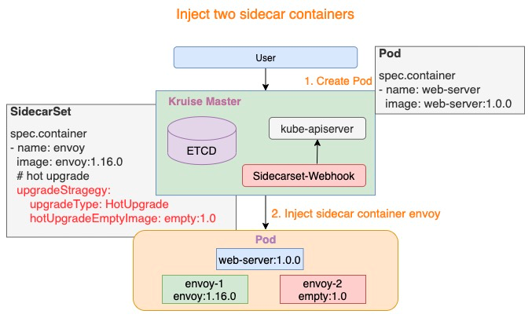
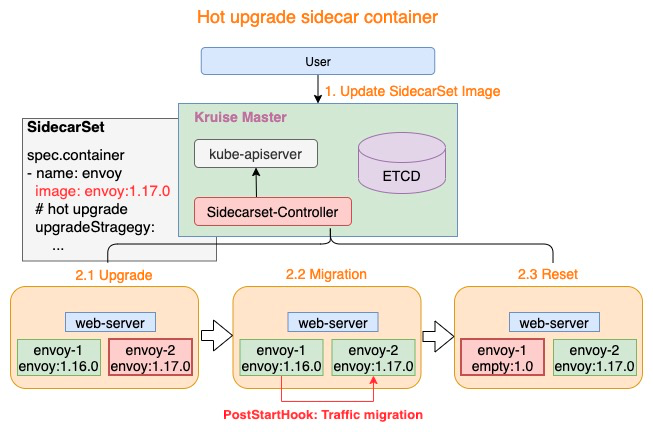

# 前言
OpenKruise 是阿里云开源的云原生应用自动化管理套件，也是当前托管在 Cloud Native Computing Foundation (CNCF) 下的Sandbox项目。它来自阿里巴巴多年来容器化、云原生的技术沉淀，是阿里内部生产环境大规模应用的基于Kubernetes之上的标准扩展组件，也是紧贴上游社区标准、适应互联网规模化场景的技术理念与最佳实践。

OpenKruise在2021.5.20发布了最新的v0.9.0版本，其中sidecarSet基于上一个版本扩展了特别针对Service Mesh场景的支持。

# 背景 - 如何独立升级Mesh容器
SidecarSet 是 Kruise 提供的独立管理 sidecar 容器的 workload。用户通过 SidecarSet 能够便利的完成对Sidecar容器的自动注入和独立升级。

默认情况下，sidecar 的独立升级顺序是先停止旧版本的容器，然后再创建新版本的容器。这种方式尤其适合不影响Pod服务可用性的sidecar容器，例如日志收集 agent，但是对于很多代理或运行时的 sidecar 容器，如 Istio Envoy，这种升级方法就有问题了。Envoy 作为 Pod 中的一个Proxy容器代理了所有的流量，这种场景下如果直接重启升级，Pod服务的可用性必然会受到影响，因此需要考虑应用自身的发布和容量情况，无法完全独立于应用做sidecar的发布。


阿里巴巴集团内部拥有上万的Pod都是基于Service Mesh来实现相互间的通信，由于mesh容器升级会导致业务pod的不可用，因而mesh容器的升级将会极大阻碍Service Mesh的迭代。针对这种场景，我们同集团内部的Service Mesh团队一起合作实现了mesh容器的热升级能力。本文将重点介绍在实现mesh容器热升级能力的过程中SidecarSet是扮演了怎样的重要角色。

# SidecarSet助力Mesh容器无损热升级
Mesh容器不能像日志采集类容器直接原地升级，其原因在于：mesh容器必须要不间断地对外提供服务，而独立升级方式会导致mesh服务存在一段不可用时间。虽然社区中已有一些知名的mesh服务如Envoy、Mosn等默认能够提供平滑升级的能力，但是这些升级方式无法与云原生进行恰当地结合，且kubernetes本身也缺乏对此类sidecar容器的升级方案。

OpenKruise SidecarSet为此类mesh容器提供了sidecar热升级机制，能够通过云原生的方式助力Mesh容器实现无损热升级。
```yaml
apiVersion: apps.kruise.io/v1alpha1
kind: SidecarSet
metadata:
  name: hotupgrade-sidecarset
spec:
  selector:
    matchLabels:
      app: hotupgrade
  containers:
  - name: sidecar
    image: openkruise/hotupgrade-sample:sidecarv1
    imagePullPolicy: Always
    lifecycle:
      postStart:
        exec:
          command:
          - /bin/sh
          - /migrate.sh
    upgradeStrategy:
      upgradeType: HotUpgrade
      hotUpgradeEmptyImage: openkruise/hotupgrade-sample:empty
```
- upgradeType: HotUpgrade代表该sidecar容器的类型是hot upgrade，即热升级方案
- hotUpgradeEmptyImage: 当热升级sidecar容器时，业务须要提供一个empty容器用于热升级过程中的容器切换。Empty容器同sidecar容器具有相同的配置（镜像地址除外），例如command, lifecycle, probe等。

SidecarSet热升级机制主要包含注入热升级Sidecar容器和Mesh容器平滑升级两个过程。

## 注入热升级Sidecar容器
针对热升级类型的Sidecar容器，在Pod创建时SidecarSet Webhook将会注入两个容器：
- \{sidecar.name\}-1: 如下图所示 envoy-1，这个容器代表正在实际工作的sidecar容器，例如：envoy:1.16.0
- \{sidecar.name\}-2: 如下图所示 envoy-2，这个容器是业务提供的hotUpgradeEmptyImage容器，例如：empty:1.0



上述Empty容器在Mesh容器运行过程中，并没有做任何实际的工作。

## Mesh容器平滑升级
热升级流程主要分为一下三个步骤：
1. Upgrade: 将Empty容器替换为最新版本的sidecar容器，例如：envoy-2.Image = envoy:1.17.0
2. Migration: 执行sidecar容器的PostStartHook脚本，完成mesh服务的平滑升级
3. Reset: mesh服务平滑升级后，将老版本sidecar容器替换为Empty容器，例如：envoy-1.Image = empty:1.0



仅需上述三个步骤即可完成热升级中的全部流程，若对Pod执行多次热升级，则重复执行上述三个步骤即可。

## Migration核心逻辑
SidecarSet热升级机制不仅完成了mesh容器的切换，并且提供了新老版本的协调机制（PostStartHook），但是至此还只是万里长征的第一步，Mesh容器同时还需要提供PostSartHook脚本来完成mesh服务自身的平滑升级（上述Migration过程），如：Envoy热重启、Mosn无损重启。

mesh容器一般都是通过监听固定端口来对外提供服务，此类mesh容器的migration过程可以概括为：通过UDS传递ListenFD和停止Accpet、开始排水。针对不支持热重启的mesh容器可以参考此过程完成改造，逻辑图如下：


## Migration Demo
不同mesh容器对外提供的服务以及内部实现逻辑各有差异，进而具体的Migration也有所不同，上述逻辑只是对其中一些要点做了一些总结，希望能对有需要的各位有所裨益，同时在github上面我们也提供了一个热升级Migration Demo以供参考，下面将对其中的一些关键代码进行介绍。

1. 协商机制
Mesh容器启动逻辑首先就需要判断第一次启动还是热升级平滑迁移过程，为了减少mesh容器沟通成本，Kruise在两个sidecar容器中注入了两个环境变量SIDECARSET_VERSION和SIDECARSET_VERSION_ALT，通过判断两个环境变量的值来判断是否是热升级过程以及当前sidecar容器是新版本还是老版本。
```
// return two parameters:
// 1. (bool) indicates whether it is hot upgrade process
// 2. (bool ) when isHotUpgrading=true, the current sidecar is newer or older
func isHotUpgradeProcess() (bool, bool) {
  // Version of the current sidecar container
  version := os.Getenv("SIDECARSET_VERSION")
  // Version of the peer sidecar container
  versionAlt := os.Getenv("SIDECARSET_VERSION_ALT")
  // If the version of the peer sidecar container is "0", hot upgrade is not underway
  if versionAlt == "0" {
    return false, false
  }
  // Hot upgrade is underway
  versionInt, _ := strconv.Atoi(version)
  versionAltInt, _ := strconv.Atoi(versionAlt)
  // version is of int type and monotonically increases, which means the version value of the new-version container will be greater
  return true, versionInt > versionAltInt
}
```

2. ListenFD迁移
通过Unix Domain Socket实现ListenFD在不同容器间的迁移，此步同样也是热升级中非常关键的一步，代码示例如下：
```
  // For code conciseness, all failures will not be captured

  /* The old sidecar migrates ListenFD to the new sidecar through Unix Domain Socket */
  // tcpLn *net.TCPListener
  f, _ := tcpLn.File()
  fdnum := f.Fd()
  data := syscall.UnixRights(int(fdnum))
  // Establish a connection with the new sidecar container through Unix Domain Socket
  raddr, _ := net.ResolveUnixAddr("unix", "/dev/shm/migrate.sock")
  uds, _ := net.DialUnix("unix", nil, raddr)
  // Use UDS to send ListenFD to the new sidecar container
  uds.WriteMsgUnix(nil, data, nil)
  // Stop receiving new requests and start the drainage phase, for example, http2 GOAWAY
  tcpLn.Close()

  /* The new sidecar receives ListenFD and starts to provide external services */
  // Listen to UDS
  addr, _ := net.ResolveUnixAddr("unix", "/dev/shm/migrate.sock")
  unixLn, _ := net.ListenUnix("unix", addr)
  conn, _ := unixLn.AcceptUnix()
  buf := make([]byte, 32)
  oob := make([]byte, 32)
  // Receive ListenFD
  _, oobn, _, _, _ := conn.ReadMsgUnix(buf, oob)
  scms, _ := syscall.ParseSocketControlMessage(oob[:oobn])
  if len(scms) > 0 {
    // Parse FD and convert to *net.TCPListener
    fds, _ := syscall.ParseUnixRights(&(scms[0]))
    f := os.NewFile(uintptr(fds[0]), "")
    ln, _ := net.FileListener(f)
    tcpLn, _ := ln.(*net.TCPListener)
    // Start to provide external services based on the received Listener. The http service is used as an example
    http.Serve(tcpLn, serveMux)
  }

```

# 已知Mesh容器热升级案例
阿里云服务网格（Alibaba Cloud Service Mesh，简称ASM）提供了一个全托管式的服务网格平台，兼容社区Istio开源服务网格。当前，基于OpenKruise SidecarSet的热升级能力，ASM实现了数据平面Sidecar热升级能力（Beta），用户可以在应用无感的情况下完成服务网格的数据平面版本升级，正式版也将于近期上线。除热升级能力外，ASM还支持配置诊断、操作审计、访问日志、监控、服务注册接入等能力，全方位提升服务网格使用体验，欢迎您前往试用。

# 总结
云原生中mesh容器的热升级一直都是迫切却又棘手的问题，本文中的方案也只是阿里巴巴集团在此问题上的一次探索，在反馈社区的同时也希望能够抛砖引玉，引发各位对此中场景的思考。同时，我们也欢迎更多的同学参与到 OpenKruise 社区来，共同建设一个场景更加丰富、完善的 K8s 应用管理、交付扩展能力，能够面向更加规模化、复杂化、极致性能的场景。
