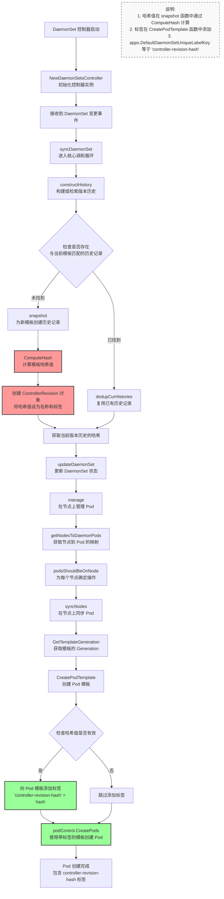

# 深入解析 Kubernetes DaemonSet 的版本控制：`controller-revision-hash` 全流程解析

在 Kubernetes 生态系统中，控制器模式（controller pattern）是维护集群状态的基石。DaemonSet 控制器作为其中的关键组件，负责确保集群中每个符合条件的节点上都运行着一个指定的 Pod 副本。当 DaemonSet 的模板更新时，控制器需要一种机制来精确识别和管理不同版本的 Pod。这一能力正是通过 `controller-revision-hash` 标签实现的。

本文将深入探讨 Kubernetes DaemonSet 控制器的版本控制机制，全面分析从模板哈希计算到将 `controller-revision-hash` 标签注入新创建 Pod 的完整过程。

## TL;DR

1.  **DaemonSet 使用 `controller-revision-hash` 标签**来追踪 Pod 模板的版本，以实现精确的滚动更新。
2.  **哈希计算发生在 `snapshot()` 函数中**，当 `constructHistory()` 检测到新的模板版本时触发。
3.  **ControllerRevision 对象存储版本历史** —— 每一次模板变更都会创建一个新的 ControllerRevision 对象，其中包含计算出的哈希值。
4.  **哈希冲突预防**：对于旧的 ControllerRevision 对象，控制器会直接使用其对象名称（保证唯一）作为哈希值，而不是重新计算，从而避免冲突。
5.  **标签注入发生在 `CreatePodTemplate()` 函数中**，在 Pod 创建之前，控制器会将哈希值作为 `controller-revision-hash` 标签添加到 Pod 中。
6.  **版本识别实现选择性更新** —— 控制器通过比较现有 Pod 的标签与当前的哈希值，来确定哪些 Pod 需要被替换。
7.  **完整流程**：模板变更 → 哈希计算 → 创建 ControllerRevision → 注入标签 → 创建带有版本标识的 Pod。

## 历史背景

在 Kubernetes 1.7 版本中，为了更好地支持 DaemonSet 的滚动更新及相关功能，引入了一个版本控制标签。该标签最初名为 `daemonset-controller-hash`，后来为了与 StatefulSet 的实现保持一致，更名为 `controller-revision-hash`。这一变化反映了 Kubernetes API 设计在标准化和一致性方面的演进。

* [GitHub Issue: Consistent hash label key across controllers](https://github.com/kubernetes/kubernetes/issues/47554)
* [GitHub PR: Rename DaemonSet and StatefulSet hash label](https://github.com/kubernetes/kubernetes/pull/47557)

## 概述：为何 `controller-revision-hash` 至关重要

`controller-revision-hash` 标签是 DaemonSet 声明式更新机制（尤其是滚动更新）的基石。其主要目的是**为 DaemonSet 的 Pod 模板（`.spec.template`）的每一个版本创建一个唯一且可追溯的指纹**。

当 DaemonSet 的 `.spec.template` 发生变更时，控制器会执行以下操作：

1.  **哈希计算**：计算新 Pod 模板内容的哈希值，生成一个新的 `controller-revision-hash` 值。
2.  **创建历史记录**：将这个哈希值连同完整的模板内容存储在一个名为 `ControllerRevision` 的独立对象中。这为每一次变更都创建了一个不可变的、可审计的记录。
3.  **版本识别与管理**：在创建新 Pod 时，控制器将这个新的哈希值作为 `controller-revision-hash` 标签注入。通过比较节点上现有 Pod 的标签与最新的哈希值，控制器可以精确地识别出哪些是需要替换的“旧版本”Pod，哪些是符合要求的“当前版本”Pod。

这个工作流确保了更新过程的精确性和可靠性，避免了在复杂集群环境中出现版本混淆。在代码库中，常量 `apps.DefaultDaemonSetUniqueLabelKey` 代表的正是这个标签键 `controller-revision-hash`。

```go
const (
// DefaultDaemonSetUniqueLabelKey 是默认的标签键，
// 它被添加到现有的 DaemonSet Pod 中，用于在 DaemonSet 模板更新期间
// 区分新旧 DaemonSet Pod。
DefaultDaemonSetUniqueLabelKey = ControllerRevisionHashLabelKey
)
```

## 详细工作流

下图展示了从 DaemonSet 控制器检测到变更到创建带有相应标签的 Pod 的完整流程。



## 步骤详解

### 1\. 初始化: NewDaemonSetsController

一切都从 DaemonSet 控制器的启动开始。`NewDaemonSetsController` 函数创建并初始化控制器实例。在此阶段，它会建立与 Kubernetes API Server 的连接，配置各种 Informer（用于监视 DaemonSet、Pod、Node 等资源的变更），创建事件记录器和工作队列。最重要的是，它将 `syncDaemonSet` 函数注册为处理工作队列中事件的核心处理器。

```go
// NewDaemonSetsController 创建一个新的 DaemonSetsController
func NewDaemonSetsController(
    ctx context.Context,
    daemonSetInformer appsinformers.DaemonSetInformer,
    // ... 其他 Informer 和客户端
) (*DaemonSetsController, error) {
    // ...
    dsc := &DaemonSetsController{
        kubeClient:       kubeClient,
        eventBroadcaster: eventBroadcaster,
        // ... 其他初始化
    }
    
    // 注册核心处理函数
    dsc.syncHandler = dsc.syncDaemonSet
    dsc.enqueueDaemonSet = dsc.enqueue

    return dsc, nil
}
```

### 2\. 调和入口: syncDaemonSet

当控制器从 Informer 收到任何关于 DaemonSet 资源的变更（创建、更新、删除）通知时，它会将资源的 `namespace/name` 作为一个键推入工作队列。`syncDaemonSet` 函数作为消费者，从队列中取出键并开始处理。它是一切调和逻辑的入口。其主要任务之一是调用 `constructHistory` 来确定当前 DaemonSet 的版本状态。

```go
func (dsc *DaemonSetsController) syncDaemonSet(ctx context.Context, dsKey string) error {
    // ... 获取 DaemonSet 对象
    
    // 构建或检索 DaemonSet 的版本历史，并获取当前模板的哈希
    cur, old, err := dsc.constructHistory(ctx, ds)
    if err != nil {
        return fmt.Errorf("failed to construct revisions of DaemonSet: %v", err)
    }
    hash := cur.Labels[apps.DefaultDaemonSetUniqueLabelKey]
    
    // ... 
    // 使用获取到的哈希继续更新管理流程
    err = dsc.updateDaemonSet(ctx, ds, nodeList, hash, dsKey, old)
    
    // ... 更新状态
}
```

### 3\. 构建版本历史: constructHistory

`constructHistory` 是版本管理的核心。它会检索与当前 DaemonSet 关联的所有 `ControllerRevision` 对象，并遍历这些历史记录，使用 `Match` 函数将它们与 DaemonSet 当前的 `.spec.template` 进行比较。

* **如果找到匹配的 `ControllerRevision`**：说明当前模板并非全新，控制器将复用这个已有的历史记录。
* **如果未找到匹配项**：说明 `.spec.template` 已发生变更，控制器需要调用 `snapshot` 函数为这个新版本创建一个新的 `ControllerRevision` 对象。

**重要：哈希冲突避免机制**

在处理历史记录时，DaemonSet 控制器采用了一种重要的兼容性与冲突预防机制。
为了解决那些在旧版 Kubernetes 中创建且没有 `controller-revision-hash` 标签的 ControllerRevision 可能带来的哈希冲突问题，控制器会检查每个历史记录是否已包含 `controller-revision-hash` 标签：

- **对于在新版本中创建的 `ControllerRevision` 对象**：该标签的值是根据模板内容计算出的哈希值。
- **对于旧版本或缺少该标签的 `ControllerRevision` 对象**：**控制器会直接使用 `ControllerRevision` 对象的名称作为标签值，而不是重新计算哈希**。

这种设计的关键优势在于，**`ControllerRevision` 对象的名称在 Kubernetes 中具有唯一性约束**，从而确保不会发生冲突。

```go
// constructHistory 查找由给定 DaemonSet 控制的所有历史记录，并
// 更新当前历史的修订号，或在需要时创建当前历史。
// 它还会对当前历史进行去重，并为现有历史添加缺失的唯一标签。
func (dsc *DaemonSetsController) constructHistory(ctx context.Context, ds *apps.DaemonSet) (cur *apps.ControllerRevision, old []*apps.ControllerRevision, err error) {
    // ...
	for _, history := range histories {
        // 如果唯一标签尚未添加到历史记录中，则添加它
        // 我们使用历史记录的名称而不是计算哈希，这样就不必担心哈希冲突
        if _, ok := history.Labels[apps.DefaultDaemonSetUniqueLabelKey]; !ok {
            toUpdate := history.DeepCopy()
            toUpdate.Labels[apps.DefaultDaemonSetUniqueLabelKey] = toUpdate.Name
            history, err = dsc.kubeClient.AppsV1().ControllerRevisions(ds.Namespace).Update(ctx, toUpdate, metav1.UpdateOptions{})
            if err != nil {
                return nil, nil, err
            }
        }
        // 将历史记录与 ds 进行比较，以区分当前和旧的历史
        found := false
        found, err = Match(ds, history)
        if err != nil {
            return nil, nil, err
        }
        if found {
            currentHistories = append(currentHistories, history)
        } else {
            old = append(old, history)
        }
    }
    currRevision := maxRevision(old) + 1
	// ...
}
```

### 4\. 创建快照与计算哈希: snapshot

当 `constructHistory` 确定需要创建一个新版本时，`snapshot` 函数便会接管。它的职责非常明确：

1.  **哈希计算**：调用 `controller.ComputeHash` 函数，该函数会对 `.spec.template` 进行序列化和哈希计算，生成一个稳定且唯一的字符串作为新版本的指纹（即哈希值）。
2.  **创建 ControllerRevision 对象**：创建一个新的 `ControllerRevision` 对象。该对象的名称包含哈希值，最重要的是，将该哈希值作为 `apps.DefaultDaemonSetUniqueLabelKey` 标签添加到对象中。
3.  **持久化**：通过 API Server 将新创建的 `ControllerRevision` 对象持久化到 etcd 中。

<!-- end list -->

```go
func (dsc *DaemonSetsController) snapshot(ctx context.Context, ds *apps.DaemonSet, revision int64) (*apps.ControllerRevision, error) {
    patch, err := getPatch(ds)
    // ...
    
    // 计算模板哈希值
    hash := controller.ComputeHash(&ds.Spec.Template, ds.Status.CollisionCount)
    name := ds.Name + "-" + hash
    
    // 创建 ControllerRevision 对象并将哈希存储为标签
    history := &apps.ControllerRevision{
        ObjectMeta: metav1.ObjectMeta{
            Name:            name,
            Namespace:       ds.Namespace,
            Labels:          labelsutil.CloneAndAddLabel(ds.Spec.Template.Labels, apps.DefaultDaemonSetUniqueLabelKey, hash),
            OwnerReferences: []metav1.OwnerReference{*metav1.NewControllerRef(ds, controllerKind)},
        },
        Data:     runtime.RawExtension{Raw: patch},
        Revision: revision,
    }

    // ... 创建 history 对象
    return history, err
}
```

### 5\. 更新与 Pod 管理: updateDaemonSet 和 manage

在获取到代表当前期望状态的 `hash` 值后，`syncDaemonSet` 会调用 `updateDaemonSet`，后者接着调用 `manage` 函数。`manage` 函数是 Pod 部署和删除的总指挥。它会获取集群中所有相关的节点和 Pod，然后分析每个节点（`podsShouldBeOnNode`），以确定：

* 哪些节点需要**创建新 Pod**（因为当前没有 Pod，或者 Pod 是旧版本的）。
* 哪些节点需要**删除旧 Pod**（因为 Pod 的 `controller-revision-hash` 标签与最新的 `hash` 不匹配）。

最后，它将需要创建和删除的 Pod 列表传递给 `syncNodes` 函数执行。

```go
func (dsc *DaemonSetsController) manage(ctx context.Context, ds *apps.DaemonSet, nodeList []*v1.Node, hash string) error {
    // 获取节点到 Pod 的映射
    nodeToDaemonPods, err := dsc.getNodesToDaemonPods(ctx, ds, false)
    // ...

    var nodesNeedingDaemonPods, podsToDelete []string
    for _, node := range nodeList {
        // 分析每个节点以确定要创建和删除哪些 Pod
        nodesNeedingDaemonPodsOnNode, podsToDeleteOnNode := dsc.podsShouldBeOnNode(
            logger, node, nodeToDaemonPods, ds, hash)

        nodesNeedingDaemonPods = append(nodesNeedingDaemonPods, nodesNeedingDaemonPodsOnNode...)
        podsToDelete = append(podsToDelete, podsToDeleteOnNode...)
    }

    // ...
    // 调用 syncNodes 来执行具体的创建和删除操作
    if err = dsc.syncNodes(ctx, ds, podsToDelete, nodesNeedingDaemonPods, hash); err != nil {
        return err
    }

    return nil
}
```

### 6\. Pod 同步: syncNodes 与基于版本的 Pod 分类

`syncNodes` 函数是 Pod 生命周期管理的执行引擎，负责处理 Pod 的创建和删除操作。
它接收三个关键参数：一个待删除的旧 Pod 列表，一个需要新 Pod 的节点列表，以及代表期望版本的当前 `hash` 值。

**syncNodes 在不同场景下的作用：**

虽然 `syncNodes` 主要由 `manage` 函数调用以执行常规的 Pod 生命周期操作，但它在 `rollingUpdate` 函数中也扮演着至关重要的角色。
在滚动更新场景中，该函数依赖通过 `findUpdatedPodsOnNode` 实现的，基于哈希的 Pod 分类：

```go
func findUpdatedPodsOnNode(ds *apps.DaemonSet, podsOnNode []*v1.Pod, hash string) (newPod, oldPod *v1.Pod, ok bool) {
	for _, pod := range podsOnNode {
		// ...
		// 在 IsPodUpdated 函数内部，hashMatches := len(hash) > 0 && pod.Labels[extensions.DefaultDaemonSetUniqueLabelKey] == hash
		if util.IsPodUpdated(pod, hash, generation) {
			if newPod != nil {
				return nil, nil, false
			}
			newPod = pod
		} else {
			if oldPod != nil {
				return nil, nil, false
			}
			oldPod = pod
		}
	}
	return newPod, oldPod, true
}
```

`rollingUpdate` 函数利用这种分类机制来决定删除哪些 Pod 以及哪些节点需要新 Pod，然后将这些决策传递给 `syncNodes` 执行。
这种基于哈希的方法确保了只有过时的 Pod 会被替换，同时保留期望版本的 Pod，从而实现了精确高效的滚动更新。

### 7\. Pod 模板准备: CreatePodTemplate

在 `syncNodes` 函数准备批量创建 Pod 之前，它会调用一个关键的辅助函数 `util.CreatePodTemplate`。**`controller-revision-hash` 标签正是在这里被最终添加到 Pod 模板中的**。该函数接收原始的 Pod 模板和 `hash` 值，然后：

1.  深拷贝一个新的 Pod 模板，以避免修改原始对象。
2.  向模板中添加默认的 DaemonSet 容忍度（toleration）。
3.  **将传入的 `hash` 值作为标签添加到模板的 `.metadata.labels` 中，使用的键为 `extensions.DefaultDaemonSetUniqueLabelKey` (`controller-revision-hash`)。**

<!-- end list -->

```go
// CreatePodTemplate 返回所提供模板的副本，其中包含额外的
// 标签（包含 templateGeneration 以实现向后兼容）、
// 所提供模板的哈希，并设置默认的 daemon 容忍度。
func CreatePodTemplate(template v1.PodTemplateSpec, generation *int64, hash string) v1.PodTemplateSpec {
    // 深拷贝模板
    newTemplate := *template.DeepCopy()
    // ...

    // 确保 labels map 存在
    if newTemplate.ObjectMeta.Labels == nil {
        newTemplate.ObjectMeta.Labels = make(map[string]string)
    }
    
    // ...
    
    // 添加哈希标签 - 这是关键步骤
    if len(hash) > 0 {
        newTemplate.ObjectMeta.Labels[extensions.DefaultDaemonSetUniqueLabelKey] = hash
    }
    
    return newTemplate
}
```

### 8\. 创建 Pod

在 `CreatePodTemplate` 返回带有新标签的模板后，`syncNodes` 函数会使用这个最终版本的模板，通过 `podControl.CreatePods` 接口为每个需要部署的节点创建新的 Pod。至此，一个携带正确版本标识的 Pod 已成功创建并被调度到目标节点。

```go
// 在 syncNodes 函数中
template := util.CreatePodTemplate(ds.Spec.Template, generation, hash)
...
podTemplate := template.DeepCopy()
...
// 使用注入了哈希标签的模板创建 Pod
err := dsc.podControl.CreatePods(ctx, ds.Namespace, podTemplate, ds, metav1.NewControllerRef(ds, controllerKind))
```

## 总结

DaemonSet 控制器通过一个设计优雅且严谨的工作流，确保了其管理的所有 Pod 都携带正确的版本标识。这个过程可以总结为以下几个核心原则：

1.  **Pod 模板是版本控制的基础**：所有的版本控制都围绕 DaemonSet 的 Pod 模板展开。任何对模板的修改都被视为一次新版本的发布。
2.  **哈希是版本的指纹**：控制器通过计算模板的哈希值，为每个版本生成一个唯一且确定的标识符。
3.  **ControllerRevision 是持久化的凭证**：哈希与模板的对应关系被记录在 `ControllerRevision` 对象中，为版本追踪和管理提供了可靠的依据。
4.  **标签是运行时的标识**：最后，这个哈希值通过 `controller-revision-hash` 标签被注入到 Pod 中，使得控制器在运行时能够轻松识别其版本。

这种“哈希-历史-标签”（hash-history-label）机制是控制器模式在 Kubernetes 中实现可靠、自动化滚动更新的典范。