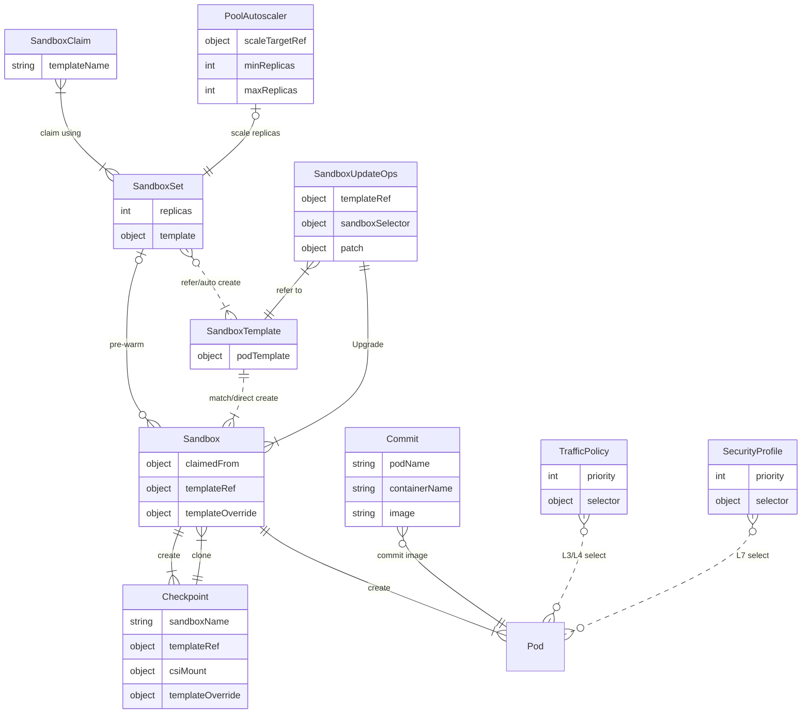

# 核心概念

## 资源关系

下图展示了 OpenKruise Agents 各 CRD 之间的关联关系：

## Sandbox
Sandbox 是 OpenKruise Agents 的核心 CRD。它负责管理沙箱实例的生命周期，并提供包括暂停（Pause）、恢复（Resume）、检查点（Checkpoint）、克隆（Clone）以及原地升级在内的高级功能。

## SandboxSet
SandboxSet 是用于管理 Sandbox 的工作负载。其功能类似于管理 Pod 的 ReplicaSet。它通过预热沙箱实例池，实现了沙箱的亚秒级启动。SandboxSet 专为扩缩容性能进行了优化，能够在沙箱被消耗时快速进行补充。

## SandboxClaim
SandboxClaim 是从 SandboxSet 中申请（Claim）一个未使用 Sandbox 的请求。一旦某个 Sandbox 被申请，它将不再对其他申请请求可用，并将经历一系列后处理流程，包括原地更新和动态存储挂载。

## SandboxTemplate
SandboxTemplate 是一种不可变资源，代表沙箱模板的一个修订版本。如果 SandboxSet 的模板正在发生变更，它可能会包含多个 SandboxTemplate。

## Checkpoint
Checkpoint 是沙箱中间状态（可能包括内存、根文件系统等）的快照。检查点可以从正在运行的 Sandbox 中创建，并可用于克隆多个沙箱。检查点与创建它的 Sandbox 所属的 SandboxTemplate 相关联。

## Commit
Commit 将正在运行的 Sandbox 容器的可写文件系统层保存为一个新的容器镜像，并推送到镜像仓库。与 Checkpoint（为暂停/恢复和克隆工作流捕获运行时状态）不同，Commit 产出的是一个普通容器镜像，任何兼容的容器运行时都可以拉取，也可以被未来的沙箱模板引用。Commit 是由 `Commit` 特性门控（Feature Gate）控制的 Alpha 特性。参见 [Commit 沙箱镜像](./user-manuals/commit.md)。

## SandboxUpdateOps
SandboxUpdateOps 用于对已被申请（Claim）、正在运行中的 Sandbox 执行批量升级。它通过标签选择器（Label Selector）选中目标 Sandbox，并对每个 Sandbox 应用 Strategic Merge Patch（或引用某个 SandboxTemplate 修订版本），还可以选择配置升级前/升级后生命周期钩子。参见 [升级沙箱](./user-manuals/sandbox-update.md)。

## PoolAutoscaler
PoolAutoscaler 通过改写 SandboxSet 的 `spec.replicas` 来自动调整预热池的规模。当未被申请的 Sandbox 数量不足时补充池容量（容量策略），在空闲实例过多时缩减池规模，并能针对已知高峰提前预热（Cron 策略）。在同一命名空间内，一个 SandboxSet 最多只能由一个 PoolAutoscaler 管理。参见 [预热池自动扩缩容](./user-manuals/poolautoscaler.md)。

## TrafficPolicy
TrafficPolicy 为通过标签选中的 Pod（包括 Sandbox Pod）定义 L3/L4 层的入向（Ingress）与出向（Egress）流量规则。每个方向持有一组有序的 allow/reject 规则；规则通过通信对端（CIDR、FQDN、Kubernetes Service 或工作负载选择器）以及协议/端口组合进行匹配，首条匹配的规则生效。当多个策略选中同一个 Pod 时，由 `spec.priority` 决定评估顺序。GlobalTrafficPolicy 是其集群级（Cluster-scoped）对应资源，作用于所有命名空间。

## SecurityProfile
SecurityProfile 为通过标签选中的 Pod 定义 L7 层安全策略。其有序规则链可匹配 HTTP 请求（主机、路径、方法、请求头、查询参数）以及 MCP 工具调用，并支持阻断请求、跳过后续规则、操作请求头、通过令牌转换（Token Transformation）注入或改写凭据、执行 MCP 工具允许/拒绝规则，以及向 Webhook 异步发送审计事件。多个 Profile 按 `spec.priority` 顺序评估，所有匹配 Profile 的规则会合并执行。GlobalSecurityProfile 是其集群级（Cluster-scoped）对应资源，作用于所有命名空间。
