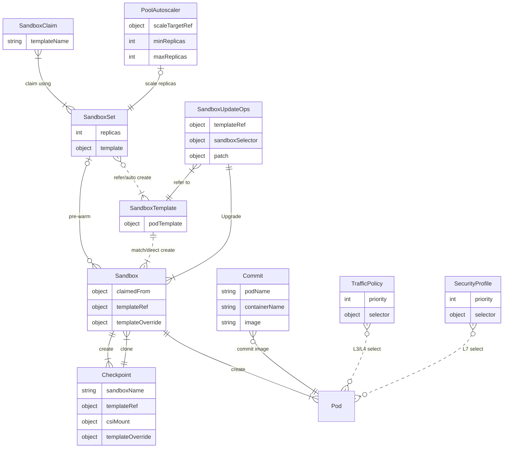

# Core Concept

## Resource Relationships

The following diagram shows how the OpenKruise Agents CRDs relate to each other:

## Sandbox

`Sandbox` is the core CRD of OpenKruise Agents. It manages the lifecycle of a sandbox instance (such as a Pod) and
provides advanced features including Pause, Resume, Checkpoint, Fork, and in-place upgrades.

## SandboxSet

`SandboxSet` is the workload that manages `Sandbox`. Its function is similar to a `ReplicaSet` that manages Pods.
It enables sub-second sandbox startup by pre-warming a pool of sandbox instances. Optimized specifically for scaling
performance, `SandboxSet` can rapidly replenish sandboxes as they are consumed.

## SandboxClaim

`SandboxClaim` is the request to claim an un-used Sandbox from SandboxSet. Once a Sandbox is claimed, it is not available for other claim requests, and will undergo a series of postprocessing including inplace-update, dynamic storage mounting.

## SandboxTemplate

`SandboxTemplate` is an immutable resource that represents a revision of sandbox templates, a `SandboxSet` may contain multiple `SandboxTemplate` if its template is being changed.

## Checkpoint

`Checkpoint` is a snapshot of sandbox intermediates states which may includes memory, rootfs etc. A checkpoint can be made from a running Sandbox, and can be used to clone multiple sandboxes. A checkpoint is related the SandboxTemplate of the Sandbox from which the Checkpoint is being made.

## Commit

`Commit` saves the writable filesystem layer of a running Sandbox container as a new container image and pushes it to an image registry. Unlike `Checkpoint`, which captures runtime state for pause/resume and fork workflows, a `Commit` produces a normal container image that can be pulled by any compatible runtime or referenced by future sandbox templates. It is an Alpha feature controlled by the `Commit` feature gate. See [Commit Sandbox Image](./user-manuals/commit.md).

## SandboxUpdateOps

`SandboxUpdateOps` performs batch upgrades of already-claimed, running Sandboxes. It selects target Sandboxes by label selector and applies a Strategic Merge Patch (or references a `SandboxTemplate` revision) to each of them, optionally with pre/post upgrade lifecycle hooks. See [Upgrade Sandboxes](./user-manuals/sandbox-update.md).

## PoolAutoscaler

`PoolAutoscaler` automatically adjusts the size of a warm pool by rewriting the `spec.replicas` of a `SandboxSet`. It replenishes the pool when the number of unclaimed Sandboxes runs low (capacity policy), shrinks it when too many instances sit idle, and pre-warms ahead of known peaks (Cron policies). Within a namespace, a `SandboxSet` can be managed by at most one `PoolAutoscaler`. See [Warm Pool Autoscaling](./user-manuals/poolautoscaler.md).

## TrafficPolicy

`TrafficPolicy` defines L3/L4 traffic rules for the ingress and egress traffic of Pods selected by labels, including Sandbox Pods. Each direction holds an ordered list of allow/reject rules; a rule matches peers (CIDR, FQDN, Kubernetes Service, or a workload selector) and protocol/port combinations, and the first matching rule wins. When multiple policies select the same Pod, `spec.priority` determines the evaluation order. `GlobalTrafficPolicy` is the cluster-scoped counterpart that applies across all namespaces.

## SecurityProfile

`SecurityProfile` defines L7 security policy for Pods selected by labels. Its ordered rule chain matches HTTP requests (host, path, method, headers, query parameters) and MCP tool calls, and can block requests, bypass remaining rules, manipulate request headers, inject or rewrite credentials via token transformation, enforce MCP tool allow/deny rules, and emit asynchronous audit events to a webhook. Profiles are evaluated in `spec.priority` order, and rules from all matching profiles are combined. `GlobalSecurityProfile` is the cluster-scoped counterpart that applies across all namespaces.
