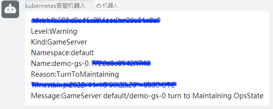

# Service Qualities
## Feature overview

Because a game server is stateful, a game server usually exists in a pod in the form of a rich container, and multiple processes are managed in a pod in a centralized manner.
However, the processes in a pod vary in importance. If an error occurs in a lightweight process, you may not want to delete and recreate the entire pod. Therefore, the native liveness probe feature of Kubernetes does not suit gaming scenarios.
In OpenKruiseGame, the service quality of game servers is defined by game developers. Game developers can set handling actions based on the statuses of game servers. The custom service quality feature is a combination of probing and action. This combination helps automatically deal with various issues related to game server statuses.

## Instructions for use
Use custom quality of service features via `GameServerSet.Spec.ServiceQualities`. Its detailed data structure is as follows:

```
type GameServerSetSpec struct {
	// ...
	ServiceQualities     []ServiceQuality   `json:"serviceQualities,omitempty"`
	// ...
}

type ServiceQuality struct {
	corev1.Probe  `json:",inline"`
	Name          string `json:"name"`
	ContainerName string `json:"containerName,omitempty"`
	// Whether to make GameServerSpec not change after the ServiceQualityAction is executed.
	// When Permanent is true, regardless of the detection results, ServiceQualityAction will only be executed once.
	// When Permanent is false, ServiceQualityAction can be executed again even though ServiceQualityAction has been executed.
	Permanent            bool                   `json:"permanent"`
	ServiceQualityAction []ServiceQualityAction `json:"serviceQualityAction,omitempty"`
}

type ServiceQualityAction struct {
	State bool `json:"state"`
	// Result indicate the probe message returned by the script.
	// When Result is defined, it would exec action only when the according Result is actually returns.
	Result         string `json:"result,omitempty"`
	GameServerSpec `json:",inline"`
	Annotations    map[string]string `json:"annotations,omitempty"`
	Labels         map[string]string `json:"labels,omitempty"`
}
```

Users implement a detection script to reveal the business/operation and maintenance status in the container to the Kubernetes GameServer object.
Supports multiple result output: the exit code 0 in the script corresponds to the State of ServiceQualityAction is true; the exit code 1 in the script corresponds to the State of ServiceQualityAction is false; the echo string in the script corresponds to the Result value of ServiceQualityAction.
When State and Result are satisfied at the same time, GameServer's GameServerSpec/Annotations/Labels will be set according to the parameters filled in by the user. GameServerSpec includes OpsState/NetworkDisabled, etc. The specific fields are as follows:

```
type GameServerSpec struct {
	OpsState         OpsState            `json:"opsState,omitempty"`
	UpdatePriority   *intstr.IntOrString `json:"updatePriority,omitempty"`
	DeletionPriority *intstr.IntOrString `json:"deletionPriority,omitempty"`
	NetworkDisabled  bool                `json:"networkDisabled,omitempty"`
	// Containers can be used to make the corresponding GameServer container fields
	// different from the fields defined by GameServerTemplate in GameServerSetSpec.
	Containers []GameServerContainer `json:"containers,omitempty"`
}
```

## Example

Let's take an example to see how to realize multiple status awareness of the game server through a detection script.

When making a container image, write a script to detect the status of the container. The sample script probe.sh will detect whether the gate process and data process exist.
When the gate process does not exist, it outputs "gate" and exits normally; when the data process does not exist, it outputs "data" and exits normally; when there is no exception, it exits with exit code 1.

The probe.sh script is a detection script within the business container, which is periodically called by OKG.
Its principle is similar to the Kubernetes native liveness/readiness probes. In the aforementioned scenario, the pseudocode for probe.sh is as follows:

```shell
#!/bin/bash

gate=$(ps -ef | grep gate | grep -v grep | wc -l)
data=$(ps -ef | grep data | grep -v grep | wc -l)

if [ $gate != 1 ]
then
  echo "gate"
  exit 0
fi

if [ $data != 1 ]
then
  echo "data"
  exit 0
fi

exit 1
```

The corresponding yaml of GameServerSet is as follows:

```yaml
apiVersion: game.kruise.io/v1alpha1
kind: GameServerSet
metadata:
  name: minecraft
  namespace: default
spec:
  replicas: 3
  updateStrategy:
    rollingUpdate:
      podUpdatePolicy: InPlaceIfPossible
      maxUnavailable: 100%
  gameServerTemplate:
    spec:
      containers:
        - image: registry.cn-beijing.aliyuncs.com/chrisliu95/minecraft-demo:probe-v0
          name: minecraft
  serviceQualities:
    - name: healthy
      containerName: minecraft
      permanent: false
      exec:
        command: ["bash", "./probe.sh"]
      serviceQualityAction:
        - state: true
          result: gate
          opsState: GateMaintaining
        - state: true
          result: data
          opsState: DataMaintaining
        - state: false
          opsState: None
```

After the deployment is completed, 3 Pods and GameServer are generated

```bash
kubectl get gs
NAME          STATE   OPSSTATE   DP    UP    AGE
minecraft-0   Ready   None       0     0     14s
minecraft-1   Ready   None       0     0     14s
minecraft-2   Ready   None       0     0     14s

kubectl get po
NAME          READY   STATUS    RESTARTS   AGE
minecraft-0   1/1     Running   0          15s
minecraft-1   1/1     Running   0          15s
minecraft-2   1/1     Running   0          15s
```

Enter the minecraft-0 container, simulate the gate process failure, and kill its corresponding process number.

```bash
kubectl exec -it minecraft-0 /bin/bash

/data# ps -ef
UID          PID    PPID  C STIME TTY          TIME CMD
root           1       0  0 03:00 ?        00:00:00 /bin/bash ./start.sh
root           7       1  0 03:00 ?        00:00:00 /bin/bash ./gate.sh
root           8       1  0 03:00 ?        00:00:00 /bin/bash ./data.sh
root           9       1 99 03:00 ?        00:00:24 java -jar /minecraft_server.
...

/data# kill -9 7

/data# exit
```

Get the opsState of the current gs, which has changed to GateMaintaining

```bash

kubectl get gs
NAME          STATE   OPSSTATE          DP    UP    AGE
minecraft-0   Ready   GateMaintaining   0     0     2m14s
minecraft-1   Ready   None              0     0     2m14s
minecraft-2   Ready   None              0     0     2m14s
```

Enter the minecraft-1 container, simulate the data process failure, and kill its corresponding process number.

```bash
kubectl exec -it minecraft-1 /bin/bash

/data# ps -ef
UID          PID    PPID  C STIME TTY          TIME CMD
root           1       0  0 03:00 ?        00:00:00 /bin/bash ./start.sh
root           7       1  0 03:00 ?        00:00:00 /bin/bash ./gate.sh
root           8       1  0 03:00 ?        00:00:00 /bin/bash ./data.sh
root           9       1 99 03:00 ?        00:00:24 java -jar /minecraft_server.
...

/data# kill -9 8

/data# exit
```

Get the opsState of the current gs, which has changed to DataMaintaining

```bash
kubectl get gs
NAME          STATE   OPSSTATE          DP    UP    AGE
minecraft-0   Ready   GateMaintaining   0     0     3m10s
minecraft-1   Ready   DataMaintaining   0     0     3m10s
minecraft-2   Ready   None              0     0     3m10s
```

Enter minecraft-0 and minecraft-1 respectively, and manually pull up the hung process:

```bash
kubectl exec -it minecraft-0 /bin/bash

/data# bash ./gate.sh &

/data# exit

kubectl exec -it minecraft-1 /bin/bash

/data# bash ./data.sh &

/data# exit
```

At this time, the operation and maintenance status of gs has returned to None.

```bash
kubectl get gs
NAME          STATE   OPSSTATE   DP    UP    AGE
minecraft-0   Ready   None       0     0     5m6s
minecraft-1   Ready   None       0     0     5m6s
minecraft-2   Ready   None       0     0     5m6s
```

## Usage Scenarios

### Set the O&M status of idle game servers to WaitToBeDeleted

Deploy a GameServerSet that contains the custom service quality field.
```shell
cat <<EOF | kubectl apply -f -
apiVersion: game.kruise.io/v1alpha1
kind: GameServerSet
metadata:
  name: minecraft
  namespace: default
spec:
  replicas: 3
  gameServerTemplate:
    spec:
      containers:
        - image: registry.cn-hangzhou.aliyuncs.com/gs-demo/gameserver:idle
          name: minecraft
  updateStrategy:
    rollingUpdate:
      podUpdatePolicy: InPlaceIfPossible
      maxUnavailable: 100%
  serviceQualities: # Set the service quality named idle.
    - name: idle
      containerName: minecraft
      permanent: false
      # Similar to the native probe feature, a script is executed to probe whether a game server is idle, that is, whether no player joins the game server.
      exec:
        command: ["bash", "./idle.sh"]
      serviceQualityAction:
          # If no player joins the game server, the O&M status of the game server is set to WaitToBeDeleted.
        - state: true
          opsState: WaitToBeDeleted
          # If players join the game server, the O&M status of the game server is set to None.
        - state: false
          opsState: None
EOF
```

After the deployment is completed, because no players have joined the game servers, all game servers are idle and their O&M status is WaitToBeDeleted.
```shell
kubectl get gs
NAME          STATE   OPSSTATE          DP    UP
minecraft-0   Ready   WaitToBeDeleted   0     0
minecraft-1   Ready   WaitToBeDeleted   0     0
minecraft-2   Ready   WaitToBeDeleted   0     0
```

When a player accesses the game server minecraft-1, the O&M status of the game server changes to None.
```shell
kubectl get gs
NAME          STATE   OPSSTATE          DP    UP
minecraft-0   Ready   WaitToBeDeleted   0     0
minecraft-1   Ready   None              0     0
minecraft-2   Ready   WaitToBeDeleted   0     0
```

In this case, if game servers are scaled in, game servers other than minecraft-1 are deleted first.

### Set the O&M status of unhealthy game servers to Maintaining

Deploy a GameServerSet that contains the custom service quality field.
```shell
cat <<EOF | kubectl apply -f -
apiVersion: game.kruise.io/v1alpha1
kind: GameServerSet
metadata:
  name: demo-gs
  namespace: default
spec:
  replicas: 3
  gameServerTemplate:
    spec:
      containers:
        - image: registry.cn-hangzhou.aliyuncs.com/gs-demo/gameserver:healthy
          name: minecraft
  updateStrategy:
    rollingUpdate:
      podUpdatePolicy: InPlaceIfPossible
      maxUnavailable: 100%
  serviceQualities: # Set the service quality named healthy.
    - name: idle
      containerName: minecraft
      permanent: false
      # Similar to the native probe feature, a script is executed to probe whether a game server is healthy.
      exec:
        command: ["bash", "./healthy.sh"]
      serviceQualityAction:
          # If the game server is healthy, the O&M status of the game server is set to None.
        - state: true
          opsState: None
          # If the game server is unhealthy, the O&M status of the game server is set to Maintaining.
        - state: false
          opsState: Maintaining
EOF
```

After the deployment is completed, because all the game servers are healthy, the O&M status of all the game servers is None.
```shell
kubectl get gs
NAME        STATE   OPSSTATE   DP    UP
demo-gs-0   Ready   None       0     0
demo-gs-1   Ready   None       0     0
demo-gs-2   Ready   None       0     0
```

Simulate a failure of a process on the game server demo-gs-0. Then, the O&M status of this game server changes to Maintaining.
```shell
kubectl get gs
NAME        STATE   OPSSTATE     DP    UP
demo-gs-0   Ready   Maintaining  0     0
demo-gs-1   Ready   None         0     0
demo-gs-2   Ready   None         0     0
```

In this case, the game server controller sends the event "GameServer demo-gs-0 Warning". You can use the [kube-event project](https://github.com/AliyunContainerService/kube-eventer) to implement exception notification.



In addition, OpenKruiseGame will integrate the tools that are used to automatically troubleshoot and recover game servers in the future to enhance automated O&M capabilities for game servers.

## Template Variable Support

Since v1.1.0, the `ServiceQualityAction` fields (`opsState`, `deletionPriority`, `updatePriority`) support Go template syntax. This allows you to dynamically compute values based on the probe script's standard output, enabling more flexible and automated game server management.

### Supported Template Variables

| Variable | Type | Description |
|----------|------|-------------|
| `.Result` | string | The standard output (stdout) of the probe script, with leading/trailing whitespace trimmed |

### Supported Comparison Functions

The following comparison functions are available in template expressions. When both arguments are valid numeric strings, numeric comparison is performed; otherwise, lexicographic string comparison is used.

| Function | Description | Example |
|----------|-------------|---------|
| `eq(a, b)` | Equal | `{{ if eq .Result "ready" }}...{{ end }}` |
| `ne(a, b)` | Not equal | `{{ if ne .Result "" }}...{{ end }}` |
| `lt(a, b)` | Less than | `{{ if lt .Result "50" }}...{{ end }}` |
| `le(a, b)` | Less than or equal | `{{ if le .Result "100" }}...{{ end }}` |
| `gt(a, b)` | Greater than | `{{ if gt .Result "2.0" }}...{{ end }}` |
| `ge(a, b)` | Greater than or equal | `{{ if ge .Result "1" }}...{{ end }}` |

### Use Cases

#### Dynamically set opsState based on CPU load

When the system load exceeds a threshold, automatically mark the game server as `Maintaining`:

```yaml
serviceQualities:
  - name: cpu-check
    containerName: game-server
    permanent: false
    exec:
      command: ["bash", "-c", "cat /proc/loadavg | awk '{print $1}'"]
    serviceQualityAction:
      - state: true
        opsState: '{{ if gt .Result "2.0" }}Maintaining{{ else }}None{{ end }}'
```

#### Mark game servers as deletable based on online player count

When the number of online players is 0, mark the game server as `WaitToBeDeleted` so it gets priority during scale-down:

```yaml
serviceQualities:
  - name: player-count
    containerName: game-server
    permanent: false
    exec:
      command: ["bash", "-c", "/opt/get_player_count.sh"]
    serviceQualityAction:
      - state: true
        opsState: '{{ if eq .Result "0" }}WaitToBeDeleted{{ else }}None{{ end }}'
```

#### Dynamic deletion priority based on player count

Set `deletionPriority` dynamically so that game servers with fewer players are deleted first during scale-down:

```yaml
serviceQualities:
  - name: player-priority
    containerName: game-server
    permanent: false
    exec:
      command: ["bash", "-c", "/opt/get_player_count.sh"]
    serviceQualityAction:
      - state: true
        deletionPriority: '{{ if eq .Result "0" }}100{{ else }}0{{ end }}'
```

### Complete GameServerSet Example

```yaml
apiVersion: game.kruise.io/v1alpha1
kind: GameServerSet
metadata:
  name: game-with-template
  namespace: default
spec:
  replicas: 3
  updateStrategy:
    rollingUpdate:
      podUpdatePolicy: InPlaceIfPossible
      maxUnavailable: 100%
  gameServerTemplate:
    spec:
      containers:
        - image: registry.cn-hangzhou.aliyuncs.com/gs-demo/gameserver:latest
          name: game-server
  serviceQualities:
    - name: load-monitor
      containerName: game-server
      permanent: false
      exec:
        command: ["bash", "-c", "cat /proc/loadavg | awk '{print $1}'"]
      serviceQualityAction:
        # When probe succeeds (exit code 0), evaluate the template
        - state: true
          opsState: '{{ if gt .Result "3.0" }}HighLoad{{ else if gt .Result "1.5" }}Busy{{ else }}None{{ end }}'
    - name: player-count
      containerName: game-server
      permanent: false
      exec:
        command: ["bash", "-c", "/opt/get_player_count.sh"]
      serviceQualityAction:
        - state: true
          opsState: '{{ if eq .Result "0" }}WaitToBeDeleted{{ else }}None{{ end }}'
          deletionPriority: '{{ if eq .Result "0" }}100{{ else }}0{{ end }}'
```

### Rendering Failure Behavior

- If the template string does not contain `{{`, it is returned as-is (no rendering is attempted).
- If the template parsing fails (e.g., syntax error), the original string is returned unchanged.
- If the template execution fails (e.g., referencing an undefined variable), the original string is returned unchanged.
- For `deletionPriority` and `updatePriority`, the rendered value must be a valid integer. If it is not numeric, the action is skipped and an error is logged.

This fail-safe design ensures that template misconfiguration will not break existing game server states.

### Notes

- Template syntax follows Go's `text/template` standard. Refer to [Go template documentation](https://pkg.go.dev/text/template) for advanced usage.
- The `.Result` value is the raw stdout from the probe script. Ensure your script outputs clean values without extra newlines or spaces.
- Numeric comparison supports floating-point strings (e.g., `"2.5"`, `"0.01"`). Non-numeric strings fall back to lexicographic comparison.
- When using template expressions in YAML, always quote the value with single quotes to avoid YAML parsing issues (e.g., `opsState: '{{ ... }}'`).
