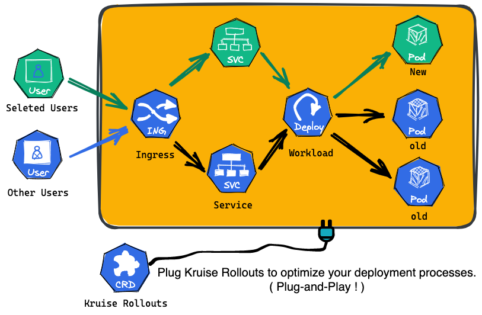

import SubProjectHero from '@site/src/components/SubProjectHero';

<SubProjectHero
  title="Kruise Rollouts"
  tagline="Progressive delivery for Kubernetes — canary, blue-green, A/B testing."
  github="https://github.com/openkruise/rollouts"
  accent="#6f42c1"
/>

## What is Kruise Rollouts? 

Kruise Rollouts is a **Bypass** component that offers **Advanced Progressive Delivery Features**.
Its support for canary, blue-green, multi-batch, and A/B testing delivery modes can be helpful in achieving smooth and controlled rollouts of changes to your application, while its compatibility with Gateway API and various Ingress implementations makes it easier to integrate with your existing infrastructure. Overall, Kruise Rollouts is a valuable tool for Kubernetes users looking to optimize their deployment processes!

## Key Features
- **Rich release strategies**
  - Multi-batch update strategy for Deployment, CloneSet, StatefulSet, Advanced StatefulSet, Advanced DaemonSet and DaemonSet.
  - Canary update strategy for Deployment.
  - Blue-Green update strategy for Deployment, CloneSet.

- **Rich traffic routing management strategies**
  - Traffic fine-grained, weighted traffic shifting when updating workloads.
  - Traffic A/B Testing, traffic shifting based on HTTP Header&Cookie.
  - End-to-End canary deployment
  
- **Rich Traffic Protocol Supports**
  - Ingress controller integration: NGINX, ALB, Higress.
  - Service Mesh integration via GatewayAPI.
  - Pluggable Lua scripts for easily extending to other Kubernetes traffic protocols (even CRD).

## Demo Show
There is a demo of multi-batch update strategy for Deployment.

## Kruise Rollouts vs. Other Components

Kruise Rollouts vs. [Argo Rollout](https://argoproj.github.io/rollouts/) and [Flux Flagger](https://fluxcd.io/flagger/)
.

| Component      | **Kruise Rollouts**                                                               | Argo Rollouts                            | Flux Flagger                             |
|----------------|-----------------------------------------------------------------------------------|------------------------------------------|------------------------------------------|
| Core concept   | Enhance your existing workloads                                                   | Replace your workloads                   | Manage your workloads                    |
| Architecture   | Bypass                                                                            | New workload type                        | Bypass                                   |
| Plug-and-play  | Yes                                                                               | No                                       | No                                       |
| Release types  | Multi-batch, Canary, A/B Testing, End-to-End Canary, Blue-Green                   | Multi-batch, Canary, Blue-Green, A/B     | Canary, Blue-Green, A/B                  |
| Workloads      | Deployment, StatefulSet, CloneSet, DaemonSet, Advanced StatefulSet, Advanced DaemonSet | Argo-Rollout                             | Deployment, DaemonSet                    | 
| Traffic types  | Ingress, GatewayAPI, CRD (with Lua script)                                        | Ingress, GatewayAPI, APISIX, Traefik, SMI etc. | Ingress, GatewayAPI, APISIX, Traefik, SMI etc. |
| Migration cost | No need to migrate workloads and pods                                             | Must migrate workloads and pods          | Must migrate pods                        | 
| HPA compatible | Yes                                                                               | Yes                                      | No                                       |

## What's Next

Here are some recommended next steps:

- **[Install](./installation.md)** Kruise Rollout
