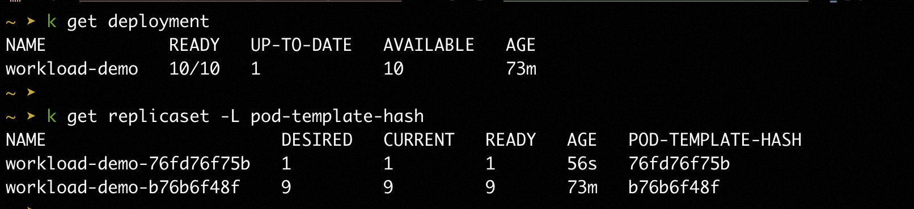
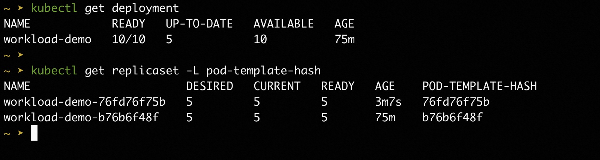
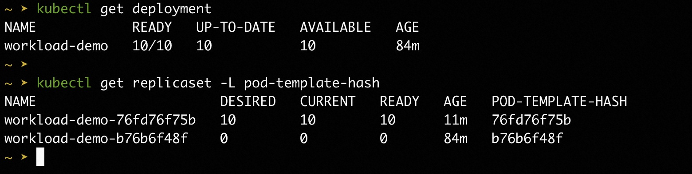

# Basic Usage Guide

import Tabs from '@theme/Tabs';
import TabItem from '@theme/TabItem';

This docs focuses on how to make Kruise Rollout effective and how to make a complete release, and answer some questions about usages.

**Note: v1beta1 available from Kruise Rollout v0.5.0.**

## A Complete Release Process

### Step 0: Requirements
- [Install](../installation.md) Kruise Rollouts.

- Assume that you **already have a Deployment in your Kubernetes cluster** as follows:
```yaml
apiVersion: apps/v1
kind: Deployment
metadata:
  name: workload-demo
  namespace: default
spec:
  replicas: 10
  selector:
    matchLabels:
      app: demo
  template:
    metadata:
      labels:
        app: demo
    spec:
      containers:
      - name: busybox
        image: busybox:latest
        command: ["/bin/sh", "-c", "sleep 100d"]
        env:
        - name: VERSION
          value: "version-1"
```

### Step 1: Prepare and apply Rollout configuration
Assume that you want to use multi-batch update strategy to upgrade your Deployment from "version-1" to "version-2":
- In the 1-st batch: **Only 1** Pod should be upgraded;
- In the 2-nd batch: **50%** Pods should be upgraded, i.e., **5 updated Pods**;
- In the 3-rd batch: **100%** Pods should be upgradedm i.e., **10 updated Pods**.

<Tabs>
  <TabItem value="v1beta1" label="v1beta1" default>

```bash
$ kubectl apply -f - <<EOF
apiVersion: rollouts.kruise.io/v1beta1
kind: Rollout
metadata:
  name: rollouts-demo
  namespace: default
spec:
  workloadRef:
    apiVersion: apps/v1
    kind: Deployment
    name: workload-demo
  strategy:
    canary:
      steps:
      - replicas: 1
      - replicas: 50%
      - replicas: 100%
EOF
```

  </TabItem>
  <TabItem value="v1alpha1" label="v1alpha1">

```bash
$ kubectl apply -f - <<EOF
apiVersion: rollouts.kruise.io/v1alpha1
kind: Rollout
metadata:
  name: rollouts-demo
  namespace: default
  annotations:
    rollouts.kruise.io/rolling-style: partition
spec:
  objectRef:
    workloadRef:
      apiVersion: apps/v1
      kind: Deployment
      name: workload-demo
  strategy:
    canary:
      steps:
      - replicas: 1
      - replicas: 50%
      - replicas: 100%
EOF
```

  </TabItem>
</Tabs>


### Step 2: Upgrade Deployment to "version-2" and release the 1-st batch
```bash
$ kubectl patch deployment workload-demo -p \
'{"spec":{"template":{"spec":{"containers":[{"name":"busybox", "env":[{"name":"VERSION", "value":"version-2"}]}]}}}}'
```
Wait a while, we will see the Deployment status show **Only 1 Pod** is upgraded.


### Step 3: Continue to release the 2-nd batch
```bash
$ kubectl-kruise rollout approve rollout/rollouts-demo -n default
```
Note: [kubectl-kruise](https://github.com/openkruise/kruise-tools) is also provided by OpenKruise community.

Wait a while, we will see the Deployment status show **5 Pod** is upgraded.


### Step 4: Continue to release the 3-rd batch
```bash
$ kubectl-kruise rollout approve rollout/rollouts-demo -n default
```
Wait a while, we will see the Deployment status show all **10 Pod** is upgraded.


## How to continue the next step manually?
Currently, there are two methods. For example, **if you have completed the first batch and want to send the second batch:**
- **Method one:** You can set the `pause.duration` field of the first batch to `duration:0`, which will automatically enter the next batch.
- **Method two:** You can update the `rollout.status.canaryStatus.currentStepState` field to `"StepReady"`, which will also automatically enter the next batch.

Each method has its own **advantages** and **disadvantages**:
- **For method one**, it can ensure the idempotence of your operation, but you need to reset the strategy of the rollout back to its original state (e.g., reset the duration field to nil) before the next release.
```yaml
kind: Rollout
spec:
  strategy:
    canary:
      steps:
      - replicas: 1
        pause:
          duration: 0
      - ... ...
```

- **For method two**, you don't need to change anything before the next release. However, before confirming, you need to check the status of Rollout and use the update interface instead of the patch interface of Kubernetes client, or use our  [kubectl-kruise](https://github.com/openkruise/kruise-tools) tools. For a detailed guide on all rollout-related commands like `describe`, `approve`, and `undo`, please see the [Kubectl Plugin documentation](../cli-tool/kubectl-plugin.md#rollout).
```bash
$ kubectl-kruise rollout approve rollout/<your-rollout-name> -n <your-rollout-namespace>
```

## How to know current step is Ready?
All status information about current step is recorded in `status.canaryStatus` field of Rollout:
- if `status.canaryStatus.CurrentStepIndex` does not equal to your expected step index, the current step is **NOT** ready.
- if `status.canaryStatus.CurrentStepState` does not equal to "StepReady" or "Complete", the current step is **NOT** ready.
```go
func IsRolloutCurrentStepReady(rollout *rolloutsv1beta1.Rollout, stepIndex int32) bool {
	if rollout.Status.CanaryStatus != nil {
		if rollout.Status.CanaryStatus.CurrentStepIndex != stepIndex {
			return false
        }
		switch rollout.Status.CanaryStatus.CurrentSetpState {
		case "StepReady", "Complete":
            return true
		}
	}
	return false
}
```

But in some automatic scenes(e.g. PaaS platform), before judging whether current step is ready, we should know whether the `canaryStatus` is corresponding to the current rollout processes (Maybe it corresponds to the last rollout process).
We can use `rollout-id` mechanism to solve this problem.
```go
func IsRolloutCurrentStepReady(workload appsv1.Deployment, rollout *rolloutsv1beta1.Rollout, stepIndex int32) bool {
	if rollout.Status.CanaryStatus != nil {
		rolloutId := workload.Labels["rollouts.kruise.io/rollout-id"]
		if rolloutId != rollout.Status.CanaryStatus.ObservedRolloutID {
			return false
        }
		if rollout.Status.CanaryStatus.CurrentStepIndex != stepIndex {
			return false
		}
		switch rollout.Status.CanaryStatus.CurrentSetpState {
		case "StepReady", "Complete":
			return true
		}
	}
	return false
}
```

## How to do rollback?

In fact, Kruise Rollout **DOES NOT** provide the ability to rollback directly. **Kruise Rollout prefers that users can rollback workload spec directly to rollback their application.** When users need to rollback from “version-2” to ”version-1“, Kruise Rollout will use the native rolling upgrade strategy to quickly rollback, instead of following the multi-batch checkpoint strategy.

### 1. Apply your old version yaml to kubernetes
If an anomaly is detected in the new version during the Rollout process, you can roll back to the previous version using the Deployment configuration. For example, deploy the deployment manifest of previous version using the command `kubectl apply -f depolyment.yaml` without making any changes to the Rollout resource.

### 2. Gitops sync old revision
You can roll back by syncing the application's revision to the old version's commit.
Execute the following command to synchronize the application to the old version, where revision is the tag of the old version.
```
argocd app sync rollouts-demo --revision gitops-demo-version-stable
```
expected output:
```
Project: default
Server: https://192.168.XX.XX:6443
Namespace: default
URL: https://127.0.0.1:49922/applications/rollouts-demo
Repo: https://github.com/Kuromesi/samples.git
Target: 616b4b6
Path: gitops-demo
SyncWindow: Sync Allowed
Sync Policy: <none>
Sync Status: Synced to 616b4b6
Health Status: Progressing

Operation: Sync
Sync Revision: 616b4b6e010ba4d71a92c0e7d050162956b169b7
Phase: Succeeded
Start: 2023-08-07 16:52:53 +0800 CST
Finished: 2023-08-07 16:52:54 +0800 CST
Duration: 1s
Message: successfully synced (all tasks run)

GROUP KIND NAMESPACE NAME STATUS HEALTH HOOK MESSAGE
 Service default echo-server Synced Healthy service/echo-server unchanged
apps Deployment default echo-server Synced Suspended deployment.apps/echo-server configured
networking.k8s.io Ingress default ingress-demo Synced Progressing ingress.networking.k8s.io/ingress-demo unchanged
rollouts.kruise.io Rollout default rollouts-demo Synced rollout.rollouts.kruise.io/rollouts-demo unchanged
```

### 3. Use kruise-tools
kruise-tools is kubectl plugin for OpenKruise, which provides commandline tools for kruise features, such as kubectl-kruise, which is a standard plugin of kubectl.
You can use the command `kubectl kruise rollout undo rollout/rollout-demo` to roll back a workload, either during the rollout process or after the rollout has finished.

## Other Statements
- **Continuous Release**: Assume that Rollout is progressing from "version-1" to "version-2"(uncompleted). Now, workload is modified to "version-3", Rollout will start to progress from beginning step (1-st step).
- **HPA compatible**: Assume that you config HPA to your workload and use multi-batch update strategy, we suggest to use "Percent" to specify "steps[x].replicas". If replicas is scaled up/down during rollout progressing, the old and new version replicas will be scaled according the "Percent" configuration.
