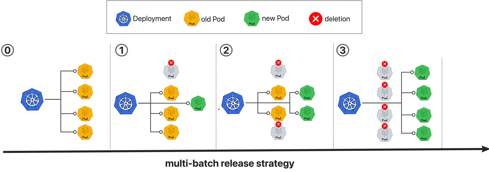

# Multi-Batch Release

import Tabs from '@theme/Tabs';
import TabItem from '@theme/TabItem';

## Overview

Multi-batch strategy is a special kind of canary release that updates application replicas in predefined stages without requiring separate canary workloads or traffic routing configurations. This approach is particularly suited for:

- Applications running multiple replicas
- Scenarios where gradual rollout validation is needed without complex traffic management
- Workloads that can be validated through replica-level monitoring rather than traffic-based analysis

## Strategy Process



The multi-batch strategy executes rollouts in sequential phases, with each batch updating a specified number or percentage of pods. Manual approval gates between batches provide control points for validation before proceeding to subsequent phases.

## Recommended Configuration

**Note: The v1beta1 API is available from Kruise Rollout v0.5.0.**

<Tabs>
  <TabItem value="v1beta1" label="v1beta1" default>

```YAML
apiVersion: rollouts.kruise.io/v1beta1
kind: Rollout
metadata:
  name: rollouts-demo
spec:
  workloadRef:
    apiVersion: apps/v1
    kind: Deployment
    name: workload-demo
  strategy:
    canary:
      enableExtraWorkloadForCanary: false
      steps:
      - replicas: 1
      - replicas: 50%
      - replicas: 100%
```

  </TabItem>
  <TabItem value="v1alpha1" label="v1alpha1">

```YAML
apiVersion: rollouts.kruise.io/v1alpha1
kind: Rollout
metadata:
  name: rollouts-demo
  annotations:
    rollouts.kruise.io/rolling-style: partition
spec:
  objectRef:
    workloadRef:
      apiVersion: apps/v1
      kind: Deployment
      name: workload-demo
  strategy:
    canary:
      steps:
      - replicas: 1
      - replicas: 50%
      - replicas: 100%
```

  </TabItem>
</Tabs>

### Supported Workload Types

The multi-batch strategy is compatible with the following Kubernetes workload resources:

- Deployment
- StatefulSet
- DaemonSet (Rollout v1beta1 only)
- Kruise Advanced StatefulSet
- Kruise Advanced DaemonSet
- Kruise CloneSet

### Behavior Explanation

When applying a new revision to `workload-demo`, the rollout progresses through the defined batches as follows:

- `1` Pods will be updated and `replicas-1` Pods is still at stable revision in the 1-st batch, need manual confirmation to next batch.
- `50%` Pods will be updated and `50%` Pods is still at stable revision in the 2-nd batch, need manual confirmation to next batch.
- `100%` Pods will be updated and `0` Pods is still at stable revision in the 3-rd batch.

Different from [canary release strategy](strategy-canary-update.md), **No extra Deployment is created during rollout progressing**.

## MinReadySeconds Strategy (Alpha)

Native Deployments can use an alternative multi-batch strategy based on the Deployment's own `minReadySeconds` field. It is an **alpha** feature selected by the `MinReadySecondsStrategy` feature gate, which is **disabled by default**.

### Why This Strategy Exists

Kubernetes treats a Pod as `Available` only after it has stayed `Ready` for `minReadySeconds`. The default multi-batch path for native Deployments pauses the workload and rewrites `spec.strategy.type` to `Recreate`, so the Rollout controller can drive partitions itself. That works, but it mutates a destructive field: if the Rollout controller or webhook is unavailable before the original strategy is restored, a later pod-template update can be handled by the native Deployment controller with Recreate semantics.

The MinReadySeconds strategy never changes `strategy.type`. Instead it inflates `minReadySeconds` so newly updated Pods become `Ready` but stay not `Available`, then widens `maxUnavailable` batch by batch. The native `RollingUpdate` controller keeps replacing Pods; Rollout only gates the pace. In the worst case Pods remain `Ready-but-not-Available` — they are never recreated en masse.

### How to Enable

Enable the feature gate via the Helm `rollout.featureGates` parameter when installing or upgrading kruise-rollout:

```bash
$ helm install kruise-rollout openkruise/kruise-rollout \
  --set rollout.featureGates="AdvancedDeployment=true,MinReadySecondsStrategy=true"
```

Or, on an existing installation, patch the controller manager args:

```bash
$ kubectl patch deployment kruise-rollout-controller-manager -n kruise-rollout --type='json' \
  -p='[{"op": "replace", "path": "/spec/template/spec/containers/0/args/1", "value": "--feature-gates=AdvancedDeployment=true,MinReadySecondsStrategy=true"}]'
```

Once enabled, every partition-style Deployment rollout in the cluster uses the MinReadySeconds strategy. The Rollout CR shape is unchanged:

```yaml
apiVersion: rollouts.kruise.io/v1beta1
kind: Rollout
metadata:
  name: rollouts-demo
spec:
  workloadRef:
    apiVersion: apps/v1
    kind: Deployment
    name: workload-demo
  strategy:
    canary:
      enableExtraWorkloadForCanary: false
      steps:
      - replicas: 1
      - replicas: 50%
      - replicas: 100%
```

### How It Differs from the Default Strategy

HPA / external scaling and PodDisruptionBudgets work with **both** strategies. A paused Deployment still processes replica changes, so Recreate-based rollouts are not frozen for HPA; PDBs continue to apply as well. The real difference is how each strategy mutates the Deployment and who drives the update.

| What changes on the Deployment | Default (Recreate-based) | MinReadySeconds |
|---|---|---|
| `spec.paused` | Set to `true` (native update controller paused) | Left `false` (native controller keeps running) |
| `spec.strategy.type` | Rewritten to `Recreate` | Left as `RollingUpdate` |
| `spec.minReadySeconds` | Unchanged | Inflated for the duration of the rollout |
| `spec.progressDeadlineSeconds` | Unchanged | Inflated for the duration of the rollout |
| `spec.strategy.rollingUpdate.maxUnavailable` | Cleared with `RollingUpdate`; partition is driven by Rollout | Inflated, then advanced batch by batch |
| `spec.strategy.rollingUpdate.maxSurge` | Driven by the Rollout controller | Left to the native Deployment controller (the user-configured value is respected) |
| Annotations | Rollout progressing markers | Plus three `rollouts.kruise.io/original-*` snapshots (see below) |
| Batch readiness | Waits until updated Pods are `Ready` | Waits until updated Pods are `Available` under the **original** `minReadySeconds` |
| Controller outage during rollout | Pods stop advancing until Rollout recovers; leftover `Recreate` is the hazard if someone then edits the pod template | Native Deployment controller keeps updating within the current `maxUnavailable` budget |

During a MinReadySeconds rollout the controller snapshots the user's `minReadySeconds`, `progressDeadlineSeconds`, and `maxUnavailable` into:

- `rollouts.kruise.io/original-min-ready-seconds`
- `rollouts.kruise.io/original-progress-deadline-seconds`
- `rollouts.kruise.io/original-max-unavailable`

It then inflates those three spec fields so it can own the rollout pace, and progressively raises `maxUnavailable` to drive each batch. After the rollout finishes, the original fields are restored and the annotations are removed.

Because `progressDeadlineSeconds` is inflated, the native Deployment controller **does not** set the `ProgressDeadlineExceeded` condition while MinReadySeconds is in control. A long-running batch is therefore not reported as a failed native Deployment rollout. Watch the Rollout / BatchRelease status (and the MinReady stuck / degraded signals) instead of that Deployment condition.

### Operation Notice

Do **not** edit the `rollouts.kruise.io/original-*` annotations by hand. They are the restore contract: if they are deleted or corrupted, the rollout is marked degraded and **pauses until you intervene** (restore the annotations, or cancel / finalize the rollout so the original fields can be recovered).

During the rollout, also do **not** expect manual edits to `minReadySeconds`, `progressDeadlineSeconds`, or `maxUnavailable` to stick. Those spec fields are owned by the MinReadySeconds controller: admission re-inflates the availability fields, and `maxUnavailable` is converged back to the current batch budget. Change the Rollout steps if you need a different pace; wait until the rollout finishes if you need to change the Deployment's own availability settings.

### Behavior Notes

- **Batch progress**: each batch increases `maxUnavailable` up to the batch target; the controller waits for the updated pods to become available under the original `minReadySeconds` before widening the budget. With a large batch after a small canary, the budget advances in sliding windows of the user's original `maxUnavailable` instead of one jump.
- **Rollback / continuous release**: works the same way as the default strategy; original availability fields are refreshed on re-inflation.
- **Upgrade compatibility**: if the controller is upgraded to enable the gate while a Deployment is mid-rollout under the previously-started Recreate-based strategy, that in-progress release keeps the Recreate strategy until it finishes, instead of being switched mid-flight.
- **Gate off mid-rollout**: a Deployment still carrying the `rollouts.kruise.io/original-*` annotations keeps using the MinReadySeconds controller until finalized, so it restores the original fields cleanly instead of being stranded.
- **Limitations (alpha)**: the strategy applies to native Deployments only; other workload types (CloneSet, StatefulSet, DaemonSet) keep the default partition strategy. `strategy.type=Recreate` on the user Deployment is rejected and reported as degraded.

